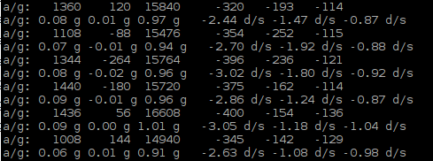

##############################################################################
Chapter Attitude Sensor MPU6050
##############################################################################

.. include:: ../common/com.Attitude Sensor MPU6050.rst

Code
================================================================

C Code 25.1.1 MPU6050RAW
----------------------------------------------------------------

First, observe the project result, and then learn about the code in detail.

.. hint:: 
    :red:`If you have any concerns, please contact us via:` support@freenove.com

1.	Use ``cd`` command to enter 25.1.1_MPU6050RAW directory of C code.

.. code-block:: console

    $ cd ~/Freenove_Kit/Code/C_Code/25.1.1_MPU6050

2.	Use following command to compile ``MPU6050RAW.c``, ``MPU6050.cpp`` and ``I2Cdev.cpp``, and generate executable file ``MPU6050RAW``.

.. code-block:: console

    $ gcc MPU6050RAW.cpp MPU6050.cpp I2Cdev.cpp -o MPU6050RAW

3.	Then run the generated file "MPU6050RAW".

.. code-block:: console

    $ sudo ./MPU6050RAW

After the program is executed, the Terminal will display active accelerometer and gyroscope data of the MPU6050, as well as the conversion to gravity acceleration and angular velocity as units of data. As shown in the following figure:

The following is the program code:

.. literalinclude:: ../../../freenove_Kit/Code/C_Code/25.1.1_MPU6050/MPU6050RAW.cpp
    :linenos: 
    :language: C

Two library files "**MPU6050.h**" and "**I2Cdev.h**" are used in the code and will be compiled with others. Class MPU6050 is used to operate the MPU6050 Sensor. When used, first it initiates an object.

.. code-block:: console

    MPU6050 accelgyro;

In the setup function, the MPU6050 is initialized and the result of the initialization will be tested.

.. literalinclude:: ../../../freenove_Kit/Code/C_Code/25.1.1_MPU6050/MPU6050RAW.cpp
    :linenos: 
    :language: C
    :lines: 18-26

In the loop function, read the original data of MPU6050, display them and then convert the original data into the corresponding acceleration and angular velocity values, then display the converted data out.

.. literalinclude:: ../../../freenove_Kit/Code/C_Code/25.1.1_MPU6050/MPU6050RAW.cpp
    :linenos: 
    :language: C
    :lines: 28-35

Finally, the main functions, called setup function and loop function respectively.

.. literalinclude:: ../../../freenove_Kit/Code/C_Code/25.1.1_MPU6050/MPU6050RAW.cpp
    :linenos: 
    :language: C
    :lines: 37-44

About class MPU6050:

.. c:function:: Class MPU6050

    This is a class library used to operate the MPU6050, which can directly read and set the MPU6050. Here are its functions: MPU6050()/MPU6050(uint8_t address);Constructor. The parameter is I2C address, and the default I2C address is 0x68.void initialize();Initialization function, used to wake up MPU6050. Range of accelerometer is ±2g and range of gyroscope is ±250 degrees/sec.void getMotion6(int16_t* ax, int16_t* ay, int16_t* az, int16_t* gx, int16_t* gy, int16_t* gz);Get the original data of accelerometer and gyroscope.int16_t getTemperature();Get the original temperature data of MPU6050.

For details about more relevant member functions, pleases refer to MPU6050.h or visit: https://github.com/jrowberg/i2cdevlib