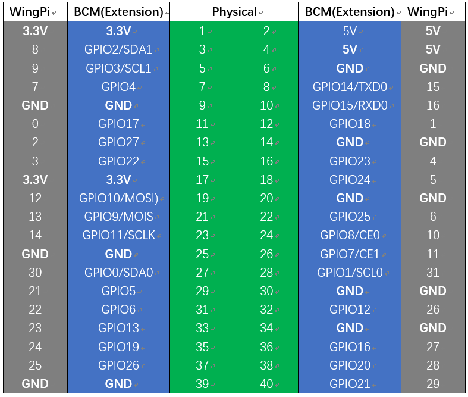

################################################################
Chapter LED
################################################################

.. include:: ../common/com.blink.rst
    
Code
================================================================
According to the circuit, when the GPIO17 of RPi output level is high, the LED turns ON. Conversely, when the GPIO17 RPi output level is low, the LED turns OFF. Therefore, we can let GPIO17 cycle output high and output low level to make the LED blink. We will use both C code to achieve the target.

C language codes 
----------------------------------------------------------------
First, enter this command into the Terminal one line at a time. Then observe the results it brings on your project, and learn about the code in detail. 

If you want to execute it with editor, please refer to section Code Editor<> to configure.

.. hint:: 
    :red:`If you have any concerns, please contact us via:` support@freenove.com

It is recommended that to execute the code via command line.

1. If you did not update wiring pi, please execute following commands **one by one**.

.. code-block:: console

    $ sudo apt-get update
    $ git clone https://github.com/WiringPi/WiringPi
    $ cd WiringPi
    $ ./build

2. Use ``cd`` command to enter 01.1.1_Blink directory of C code.

.. code-block:: console

    $ cd ~/Freenove_Kit/Code/C_Code/01.1.1_Blink

3. Use the following command to compile the code “Blink.c” and generate executable file “Blink”.

.. code-block:: console

    $ gcc Blink.c -o Blink -lwiringPi

4. Then run the generated file “blink”.

.. code-block:: console

    $ sudo ./Blink

Now your LED should start blinking! CONGRATUALTIONS! You have successfully completed your first RPi circuit! 

You can press ``Ctrl+C`` to end the program. The following is the program code:

.. literalinclude:: ../../../freenove_kit/Code/C_Code/01.1.1_Blink/Blink.c
    :linenos: 
    :language: C

In the code above, the configuration function for GPIO is shown below as:

.. c:function:: void pinMode(int pin, int mode);

    This sets the mode of a pin to either INPUT, OUTPUT, PWM_OUTPUT or GPIO_CLOCK. Note that only wiringPi pin 1 (BCM_GPIO 18) supports PWM output and only wiringPi pin 7 (BCM_GPIO 4) supports CLOCK output modes.
    
    This function has no effect when in Sys mode. If you need to change the pin mode, then you can do it with the gpio program in a script before you start your program 

.. c:function:: void digitalWrite (int pin, int value);

    Writes the value HIGH or LOW (1 or 0) to the given pin, which must have been previously set as an output.

.. seealso:: 

    For more related wiringpi functions, please refer to https://github.com/WiringPi/WiringPi

GPIO connected to ledPin in the circuit is GPIO17 and GPIO17 is defined as 0 in the wiringPi numbering. So ledPin should be defined as 0 pin. You can refer to the corresponding table in Chapter 0.

.. code-block:: c

    #define  ledPin    0 //define the led pin number

GPIO Numbering Relationship

In the main function ``main()``, initialize ``wiringPi`` first.

.. code-block:: c

    wiringPiSetup();

After the wiringPi is initialized successfully, you can set the ledPin to output mode and then enter the while loop, 
which is an endless loop (a while loop). 
That is, the program will always be executed in this cycle, 
unless it is ended because of external factors. In this loop, 
use ``digitalWrite (ledPin, HIGH)`` to make ledPin output high level, then LED turns ON. 
After a period of time delay, use ``digitalWrite(ledPin, LOW)`` to make ledPin output low level, 
then LED turns OFF, which is followed by a delay. Repeat the loop, then LED will start blinking.

.. literalinclude:: ../../../freenove_kit/Code/C_Code/01.1.1_Blink/Blink.c
    :linenos: 
    :language: C
    :lines: 16-27

.. include:: ../common/com.freenove_car.rst

.. toctree:: 
    :includehidden: