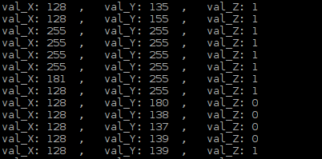

##############################################################################
Chapter Joystick
##############################################################################

.. include:: ../common/com.Joystick.rst

Code
================================================================

In this project's code, we will read the ADC values of X and Y axes of the Joystick, and read digital quality of the Z axis, then display these out in Terminal.

C Code 12.1.1 Joystick
----------------------------------------------------------------

If you did not configure I2C, please refer to Chapter 7. If you did, please continue.
First, observe the project result, and then learn about the code in detail.

.. hint:: 
    :red:`If you have any concerns, please contact us via:` support@freenove.com

1.	Use ``cd`` command to enter 12.1.1_Joystick directory of C code.

.. code-block:: console

    $ cd ~/Freenove_Kit/Code/C_Code/12.1.1_Joystick
2.	Use following command to compile ``Joystick.cpp`` and generate executable file ``Joystick``.

.. code-block:: console

    $ g++ Joystick.cpp -o Joystick -lwiringPi -lADCDevice

3.	Then run the generated file ``Joystick``.

.. code-block:: console

    $ sudo ./Joystick

After the program is executed, the terminal window will display the data of 3 axes X, Y and Z. Shifting (moving) the Joystick or pressing it down will make the data change.

The flowing is the code:

.. literalinclude:: ../../../freenove_Kit/Code/C_Code/12.1.1_Joystick/Joystick.cpp
    :linenos: 
    :language: C

In the code, configure Z_Pin to pull-up input mode. In the while loop of the main function, use analogRead () to read the value of axes X and Y and use digitalRead () to read the value of axis Z, then display them.

.. literalinclude:: ../../../freenove_Kit/Code/C_Code/12.1.1_Joystick/Joystick.cpp
    :linenos: 
    :language: C
    :lines: 37-43
