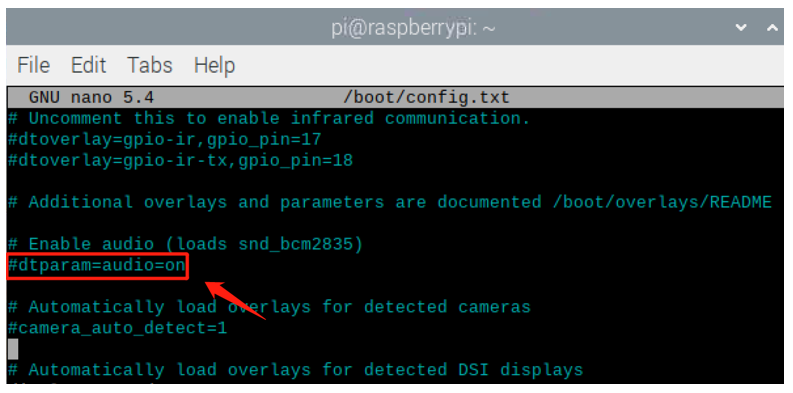

##############################################################################
Chapter LEDpixelRotary Encoder
##############################################################################

.. include:: ../common/com.LEDpixel_1.rst

Code
================================================================

C Code 32.1.1 Ledpixel
----------------------------------------------------------------

Before running C code, please install WS281X library.

1.  Enter the directory where the library locates:

.. code-block:: console    
    
    $ cd ~/Freenove_Kit/Libs/C-Libs/libWS281X

2.  Run the program

.. code-block:: console    
    
    $ sudo sh ./build.sh

The installation is completed as shown in the figure below

First, observe the project result, and then learn about the code in detail.

.. hint:: 
    :red:`If you have any concerns, please contact us via:` support@freenove.com

1.	Use cd command to enter 32.1.1_Ledpixel directory of C code.

.. code-block:: console    
    
    $ cd ~/Freenove_Kit/Code/C_Code/32.1.1_Ledpixel
2.	Use following command to compile " Ledpixel.cpp" and generate executable file "Ledpixel". 

.. code-block:: console    
    
    $ sudo g++ Ledpixel.cpp -o Ledpixel -lwiringPi -lWS281X

3.	Run the generated file " Ledpixel".

.. code-block:: console    
    
    $ sudo ./Ledpixel

After the program runs, the LEDpixel will emit red, blue and green colors in turn like flowing water. If your Freenove 8 RGB LED Module doesn't work, you can try :ref:`additional supplements` to solve.
The following is the program code:

.. literalinclude:: ../../../freenove_Kit/Code/C_Code/32.1.1_Ledpixel/Ledpixel.c
    :linenos: 
    :language: C

Include "Freenove_WS2812_Lib_for_Raspberry_Pi.hpp"

.. code-block:: c

    #include "Freenove_WS2812_Lib_for_Raspberry_Pi.hpp"

Create the object of the class and set the brightness to 50%. The eight LEDs will then light up red, green and blue in turn.

.. literalinclude:: ../../../freenove_Kit/Code/C_Code/32.1.1_Ledpixel/Ledpixel.c
    :linenos: 
    :language: C
    :lines: 24-42

.. include:: ../common/com.LEDpixel_2.rst

Code
================================================================

C Code 32.2.1 RainbowLight
----------------------------------------------------------------

If you did not configure I2C, please refer to :ref:`Chapter 7<ADC>`. If you did, please continue.

First, observe the project result, and then learn about the code in detail.

.. hint:: 
    :red:`If you have any concerns, please contact us via:` support@freenove.com

1.  Use cd command to enter 32.2.1_RainbowLight directory of C code.

.. code-block:: console    
    
    $ cd ~/Freenove_Kit/Code/C_Code/32.2.1_RainbowLight

2.  Use following command to compile " RainbowLight.cpp " and generate executable file " RainbowLight ". 

.. code-block:: console    
    
    $ sudo g++ RainbowLight.cpp -o RainbowLight -lADCDevice -lWS281X -lwiringPi

3.  Run the generated file " RainbowLight ".

.. code-block:: console    
    
    $ sudo ./RainbowLight

After running the program, you can change the color of the LED module by rotating the potentiometer.

The following is the program code:

.. literalinclude:: ../../../freenove_Kit/Code/C_Code/32.2.1_RainbowLight/RainbowLight.cpp
    :linenos: 
    :language: C

This function converts HSL colors to RGB colors.

.. literalinclude:: ../../../freenove_Kit/Code/C_Code/32.2.1_RainbowLight/RainbowLight.cpp
    :linenos: 
    :language: C
    :lines: 14-33

Read the ADC value of channel 2 in an infinite loop. Let the color of the eight LEDs change according to the value of the ADC.

.. literalinclude:: ../../../freenove_Kit/Code/C_Code/32.2.1_RainbowLight/RainbowLight.cpp
    :linenos: 
    :language: C
    :lines: 54-64

.. include:: ../common/com.LEDpixel_3.rst

Code
================================================================

C Code 32.3.1 SpiLedpixel
----------------------------------------------------------------

Use cd command to enter 32.3.1_SpiLedpixel directory of C code.

.. code-block:: console    
    
    $ cd ~/Freenove_Kit/Code/C_Code/32.3.1_SpiLedpixel

Use following command to compile " Ledpixel.cpp" and generate executable file "Ledpixel". 

.. code-block:: console    
    
    $ g++ SpiLedpixel.cpp Freenove_WS2812_SPI.cpp -o main

Run the generated file "main". **Please use one of the following commands to control the ledpixel**.

After the program runs, the led pixels will emit red, blue and green three colors in turn like water. If your Freenove 8 RGB LED module is not working, you can try additional supplements to fix it.
.. code-block:: console  
    
    $ sudo ./main RGB

After the program runs, the led pixels will emit a rainbow of colors and slowly rotate.

.. code-block:: console    
    
    $ sudo ./main Rainbow

After the program runs, the led will slowly turn on and then slowly turn off.

.. code-block:: console    
    
    $ sudo ./main Breathing

The following is the program code:

.. literalinclude:: ../../../freenove_Kit/Code/C_Code/32.3.1_SpiLedpixel/SpiLedpixel.cpp
    :linenos: 
    :language: C

.. code-block:: c   

    #include "Freenove_WS2812_SPI.h"

To create Ledpixel objects, you can use the default parameters or you can use custom parameters.

.. code-block:: c   

    //Freenove_WS2812_SPI strip = Freenove_WS2812_SPI(8, TYPE_GRB);//led_count, led_type
    Freenove_WS2812_SPI strip = Freenove_WS2812_SPI();//led_count=8, led_type=TYPE_GRB

Create an interrupt event if the user presses Ctrl+C to turn off the lights before exiting the program.

.. code-block:: c  

    void Ctrl_C_Handler(int value){
        strip.end();
        exit(0);
    }

    //Ctrl+C Event
    signal(SIGINT, Ctrl_C_Handler);  

Initialize ledpixel, set the brightness value of the color light to 20, set the type of the color light to GRB type.

.. code-block:: c  

    //Init ledpixel
    strip.begin();
    strip.setBrightness(20);
    strip.setLedType((LED_TYPE)TYPE_GRB);

Determine the number of parameters when the executable file is invoked. If no parameters are specified, a message is displayed.

.. literalinclude:: ../../../freenove_Kit/Code/C_Code/32.3.1_SpiLedpixel/SpiLedpixel.cpp
    :linenos: 
    :language: C
    :lines: 24-32

If the parameter is RGB, let the ledpixel display color one by one, and then switch to another color in turn, and continue to repeat the process.

.. literalinclude:: ../../../freenove_Kit/Code/C_Code/32.3.1_SpiLedpixel/SpiLedpixel.cpp
    :linenos: 
    :language: C
    :lines: 33-47

If the parameter is Rainbow, let the ledpixel display a rainbow of colors and turn slowly.

.. literalinclude:: ../../../freenove_Kit/Code/C_Code/32.3.1_SpiLedpixel/SpiLedpixel.cpp
    :linenos: 
    :language: C
    :lines: 48-57

If the parameter is Breathing, let the ledpixel gradually turn on one color, slowly turn off, then switch to another color, and repeat the process.

.. literalinclude:: ../../../freenove_Kit/Code/C_Code/32.3.1_SpiLedpixel/SpiLedpixel.cpp
    :linenos: 
    :language: C
    :lines: 58-78