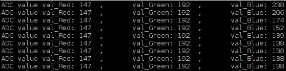

##############################################################################
Chapter Potentiometer & RGBLED
##############################################################################

.. include:: ../common/com.Potentiometer & RGBLED.rst

Code
================================================================

C Code 9.1.1 Colorful Softlight
----------------------------------------------------------------

If you did not configure I2C, please refer to :doc:`Chapter 7 ADC <ADC>`. If you did, please continue.
First, observe the project result, and then learn about the code in detail.

.. hint:: 
    :red:`If you have any concerns, please contact us via:` support@freenove.com

1.	Use ``cd`` command to enter 09.1.1_ColorfulSoftlight directory of C code.

.. code-block:: console

    $ cd ~/Freenove_Kit/Code/C_Code/09.1.1_ColorfulSoftlight

2.	Use following command to compile ``ColorfulSoftlight.cpp`` and generate executable file ``ColorfulSoftlight``.

.. code-block:: console

    $ g++ ColorfulSoftlight.cpp -o ColorfulSoftlight -lwiringPi -lADCDevice
3.	Then run the generated file ``ColorfulSoftlight``.

.. code-block:: console

    $ sudo ./ColorfulSoftlight

After the program is executed, rotate one of the potentiometers, then the color of RGB LED will change. The Terminal window will display the ADC value of each potentiometer. 

The following is the program code:

.. literalinclude:: ../../../freenove_Kit/Code/C_Code/09.1.1_ColorfulSoftlight/ColorfulSoftlight.cpp
    :linenos: 
    :language: C

In the code you can read the ADC values of the 3 potentiometers and map it into a PWM duty cycle to control the 3 LED elements to vary the color of their respective RGB LED.

