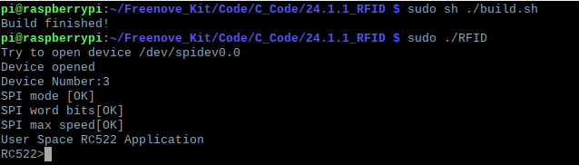
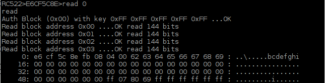
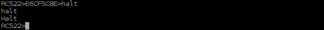

##############################################################################
Chapter RFIDLEDpixelRotary Encoder
##############################################################################

.. include:: ../common/com.RFID.rst

Code
================================================================

The project code uses human-computer interaction command line mode to read and write the M1-S50 card.

C Code 34.1.1 RFID
----------------------------------------------------------------

First observe the running result, and then learn about the code in detail.

.. hint:: 
    :red:`If you have any concerns, please contact us via:` support@freenove.com

1.	Use cd command to enter RFID directory of C code.

.. code-block:: console    
    
    $ cd ~/Freenove_Kit/Code/C_Code/34.1.1_RFID

2.	Use the following command to compile and generate executable file "RFID". 

.. code-block:: console    
    
    $ sudo sh ./build.sh

3.	Then run the generated file "RFID".

.. code-block:: console    
    
    $ sudo ./RFID

After the program is executed, the following contents will be displayed in the terminal:

Here, type the command “quit” to exit the program.

Type command "scan", and then the program begins to detect whether there is a card close to the sensing area of MFRC522 reader. Place a M1-S50 card in the sensing area. The following results indicate that the M1-S50 card has been detected, the UID of which is E6CF5C8EFB (HEX).

When the Card is placed in the sensing area, you can read and write the card with the following command.

.. image:: ../_static/imgs/RFID_Code_2.png
    :align: center

In the command read<blockstart>, the parameter blockstart is the address of the data block, and the range is 0-63. This command is used to display all the data from blockstart address to the end of the sector. For example, sector 0 contains data block 0,1,2,3. Using the command “read 0” can display all contents of data block 0,1,2,3. Using the command “read 1” can display all contents of data block 1,2,3. As is shown below:   

Command “dump” is used to display the content of all data blocks in all sectors.

Command <address> <data> is used to write “data" to data block with address “address”, where the address range is 0-63 and the data length is 0-16. For example, if you want to write the string "Freenove" to the data block with address “1”, you can type the following command.

.. code-block:: console    
    
    $ write 1 Freenove

Read the contents of this sector and check the data just written.

.. code-block:: console    
    
    $ read 0

The following results indicate that the string "Freenove" has been written successfully into the data block 1.

.. code-block:: console    
    
    $ clean 1

Read the contents of data blocks in this sector again to check whether the data is erased. The following results indicate that the contents of data block 1 have been erased.

Command “halt” is used to quit the selection state of the card.

The following is the program code:

.. literalinclude:: ../../../freenove_Kit/Code/C_Code/34.1.1_RFID/main.c
    :linenos: 
    :language: C

In the code, first initialize the MFRC522. If the initialization fails, the program will exit.

.. literalinclude:: ../../../freenove_Kit/Code/C_Code/34.1.1_RFID/main.c
    :linenos: 
    :language: C
    :lines: 31-35

In the main function, wait for the command input. If command "scan" is received, the function will begin to detect whether there is a card close to the sensing area. If a card is detected, the card will be selected and card UID will be acquired. Then enter the function scan_loop (). If command "quit" or "exit" is received, the program will exit.

.. literalinclude:: ../../../freenove_Kit/Code/C_Code/34.1.1_RFID/main.c
    :linenos: 
    :language: C
    :lines: 43-72

The function scan_loop() will detect command read, write, clean, halt, dump and do the corresponding processing to each command. The functions of each command and the method have been introduced before.

.. literalinclude:: ../../../freenove_Kit/Code/C_Code/34.1.1_RFID/main.c
    :linenos: 
    :language: C
    :lines: 83-184

The header file "mfrc522.h" contains the associated operation method for the MFRC522. You can open the file to view all the definitions and functions.