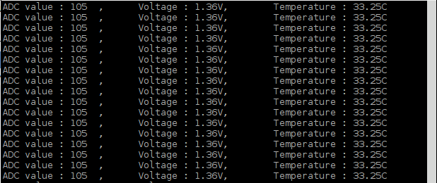

##############################################################################
Chapter Thermistor
##############################################################################

.. include:: ../common/com.Thermistor.rst

Code
================================================================

In this project code, the ADC value still needs to be read, but the difference here is that a specific formula is used to calculate the temperature value.

C Code 11.1.1 Thermometer
----------------------------------------------------------------

If you did not configure I2C, please refer to :doc:`Chapter 7 ADC <ADC>`. If you did, please continue.
First, observe the project result, and then learn about the code in detail.

.. hint:: 
    :red:`If you have any concerns, please contact us via:` support@freenove.com

1.	Use ``cd`` command to enter 11.1.1_Thermometer directory of C code.

.. code-block:: console

    $ cd ~/Freenove_Kit/Code/C_Code/11.1.1_Thermometer

2.	Use following command to compile ``Thermometer.cpp`` and generate executable file ``Thermometer``.

.. code-block:: console

    $ g++ Thermometer.cpp -o Thermometer -lwiringPi -lADCDevice

3.	Then run the generated file ``Thermometer``.

.. code-block:: console

    $ sudo ./Thermometer

After the program is executed, the Terminal window will display the current ADC value, voltage value and temperature value. Try to “pinch” the thermistor (without touching the leads) with your index finger and thumb for a brief time, you should see that the temperature value increases.

The following is the code:

.. literalinclude:: ../../../freenove_Kit/Code/C_Code/11.1.1_Thermometer/Thermometer.cpp
    :linenos: 
    :language: C

In the code, the ADC value of ADC module A0 port is read, and then calculates the voltage and the resistance of Thermistor according to Ohms Law. Finally, it calculates the temperature sensed by the Thermistor, according to the formula. 
