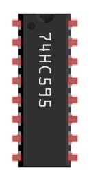
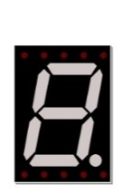
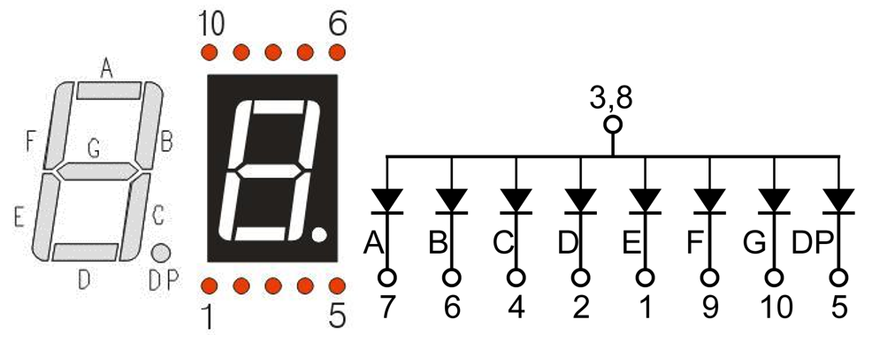
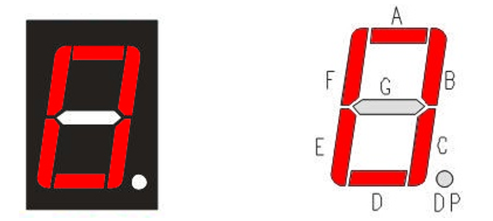
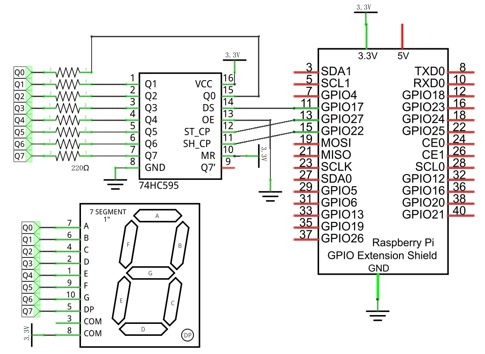
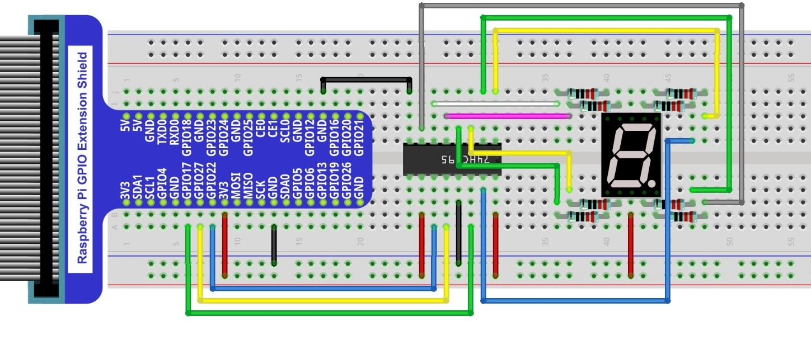

In this chapter, we will introduce the 7-Segment Display.

Project 7-Segment Display
****************************************************************

We will use a 74HC595 IC Chip to control a 7-Segment Display and make it display sixteen decimal characters "0” to “F".

Component List
================================================================

+-------------------------------------------------+-------------------------------------------------+
|1. Raspberry Pi (with 40 GPIO) x1                |                                                 |     
|                                                 |   Jumper Wires x18                              |       
|2. GPIO Extension Board & Ribbon Cable x1        |                                                 |       
|                                                 |     |jumper-wire|                               |                                                            
|3. Breadboard x1                                 |                                                 |                                                                 
+-----------------------------+-------------------+--------------+----------------------------------+
| 74HC595 x1                  | 7-Segment Display x1             | Resistor 220Ω x8                 |
|                             |                                  |                                  |
|  |74HC595|                  |  |7_Segment_Display|             |  |res-220R|                      |
+-----------------------------+----------------------------------+----------------------------------+

.. |jumper-wire| image:: ../_static/imgs/jumper-wire.png

.. |res-220R| image:: ../_static/imgs/res-220R.png
    :width: 20%

Component knowledge
================================================================

7-segment display
----------------------------------------------------------------

A 7-Segment Display is a digital electronic display device. There is a figure "8" and a decimal point represented, which consists of 8 LEDs. The LEDs have a Common Anode and individual Cathodes. Its internal structure and pin designation diagram is shown below:

As we can see in the above circuit diagram, we can control the state of each LED separately. Also, by combining LEDs with different states of ON and OFF, we can display different characters (Numbers and Letters). For example, to display a “0”: we need to turn ON LED segments A, B, C, D, E and F, and turn OFF LED segments G and DP.

In this project, we will use a 7-Segment Display with a Common Anode. Therefore, when there is an input low level to an LED segment the LED will turn ON. Defining segment “A” as the lowest level and segment “DP” as the highest level, from high to low would look like this: “DP”, “G”, “F”, “E”, “D”, “C”, “B”, “A”. Character "0" corresponds to the code: 1100 0000b=0xc0.

Circuit
================================================================

+------------------------------------------------------------------------------------------------+
|   Schematic diagram                                                                            |
|                                                                                                |
|   |7_Segment_Sc|                                                                               |
+------------------------------------------------------------------------------------------------+
|   Hardware connection. If you need any support,please feel free to contact us via:             |
|                                                                                                |
|   support@freenove.com                                                                         |
|                                                                                                |
|   |7_Segment_Fr|                                                                               | 
|                                                                                                |
|   **Video:** https://youtu.be/KSE0LdyuOFM                                                      |
+------------------------------------------------------------------------------------------------+

