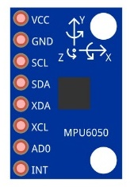
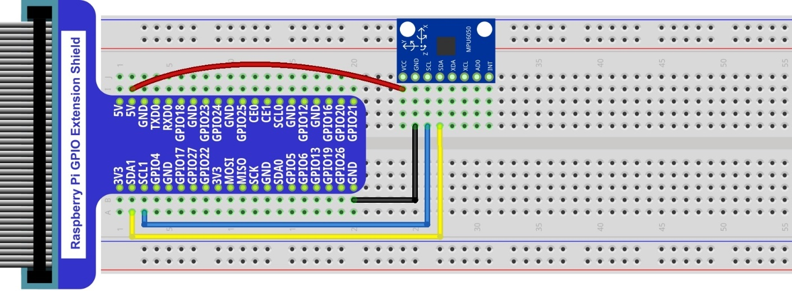

In this chapter, we will learn about a MPU6050 Attitude sensor, which integrates an Accelerometer and Gyroscope.

Project Read a MPU6050 Sensor Module
****************************************************************

In this project, we will read Acceleration and Gyroscope Data of the MPU6050 Sensor.

Component List
================================================================

+-------------------------------------------------+-------------------------------------------------+
|1. Raspberry Pi (with 40 GPIO) x1                |                                                 |     
|                                                 | Jumper Wires x4                                 |       
|2. GPIO Extension Board & Ribbon Cable x1        |                                                 |       
|                                                 |  |jumper-wire|                                  |                                                            
|3. Breadboard x1                                 |                                                 |                                                                 
+-------------------------------------------------+-------------------------------------------------+
| MPU6050                                                                                           |     
|                                                                                                   |       
|  |MPU6050|                                                                                        |       
+---------------------------------------------------------------------------------------------------+

.. |jumper-wire| image:: ../_static/imgs/jumper-wire.png

Component knowledge
================================================================

MPU6050
----------------------------------------------------------------

MPU6050 Sensor Module is a complete 6-axis Motion Tracking Device. It combines a 3-axis Gyroscope, a 3-axis Accelerometer and a DMP (Digital Motion Processor) all in a small package. The settings of the Accelerometer and Gyroscope of MPU6050 can be changed. A precision wide range digital temperature sensor is also integrated to compensate data readings for changes in temperature, and temperature values can also be read. The MPU6050 Module follows the I2C communication protocol and the default address is 0x68.

.. image:: ../_static/imgs/MPU6050_1.png
    :width: 80%
    :align: center

The port description of the MPU6050 Module is as follows:

.. list-table::
   :align: center
   :header-rows: 1
   :class: product-table

   * - Pin name
     - Pin number
     - Description

   * - VCC
     - 1
     - Positive pole of power supply with voltage 5V

   * - GND
     - 2
     - Negative pole of power supply
    
   * - SCL
     - 3
     - I2C communication clock pin
     
   * - SDA
     - 4
     - I2C communication data pin

   * - XDA
     - 5
     - I2C host data pin which can be connected to other devices.

   * - XCL
     - 6
     - I2C host clock pin which can be connected to other devices.

   * - AD0
     - 7
     - I2C address bit control pin. 

       **Low level:** the device address is 0x68 

       **High level:** the device address is 0x69

   * - INT
     - 8
     - Output interrupt pin

For more detail, please refer to the MPU6050 datasheet.

MPU6050 is widely used to assist with balancing vehicles, robots and aircraft, mobile phones and other products which require stability to control stability and attitude or which need to sense same.

+------------------------------------------------------------------------------------------------+
|   Schematic diagram                                                                            |
|                                                                                                |
|   |MPU6050_Sc|                                                                                 |
+------------------------------------------------------------------------------------------------+
|   Hardware connection. If you need any support,please feel free to contact us via:             |
|                                                                                                |
|   support@freenove.com                                                                         | 
|                                                                                                |
|   |MPU6050_Fr|                                                                                 |
+------------------------------------------------------------------------------------------------+

.. |MPU6050_Sc| image:: ../_static/imgs/MPU6050_Sc.png
