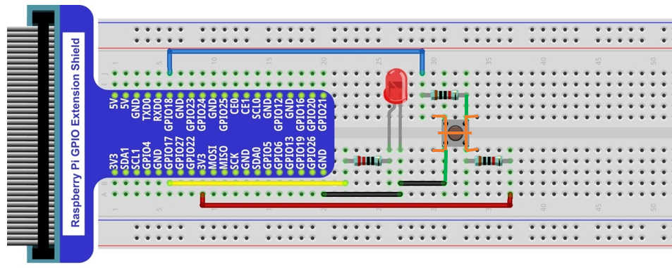

Usually, there are three essential parts in a complete automatic control device: INPUT, OUTPUT, and CONTROL. In last section, the LED module was the output part and RPI was the control part. In practical applications, we not only make LEDs flash, but also make a device sense the surrounding environment, receive instructions and then take the appropriate action such as turn on LEDs, make a buzzer beep and so on.

.. image:: ../_static/imgs/button-led-flow-chart.png
    :width: 80%

Next, we will build a simple control system to control an LED through a push button switch.

Project Push Button Switch & LED
****************************************************************

In the project, we will control the LED state through a Push Button Switch. When the button is pressed, our LED will turn ON, and when it is released, the LED will turn OFF. This describes a Momentary Switch.

Component List
================================================================

1.  | Raspberry Pi 
    | (Recommended: Raspberry Pi 5 / 4B / 3B+ / 3B)
    | (Compatible: 3A+ / 2B / 1B+ / 1A+ / Zero W / Zero) 

2.  GPIO Extension Board & Ribbon Cable

3.  Breadboard x1

    .. image:: ../_static/imgs/raspberrypi5.png
        :width: 25%

    .. image:: ../_static/imgs/raspberrypi-extension-board.jpg
        :width: 25%

    .. image:: ../_static/imgs/breadborad-830.jpg
        :width: 48%

#.  LED x1

    .. image:: ../_static/imgs/red-led.png
        :height: 100

#.  Resistor 220Ω x1

    .. image:: ../_static/imgs/res-220R-hori.png
        :height: 20

#.  Resistor 10KΩ x2

    .. image:: ../_static/imgs/res-10K-hori.png
        :height: 20

#.  Jumper (some)

    .. image:: ../_static/imgs/jumper-wire.png
        :height: 20

#.  Push Button Switch x1

    .. image:: ../_static/imgs/button-small.jpg

.. note:: 
    Please Note: In the code “button” represents switch action.

Component knowledge
================================================================

Push Button Switch
----------------------------------------------------------------
This type of Push Button Switch has 4 pins (2 Pole Switch). Two pins on the left are connected, and both left and right sides are the same per the illustration:

    .. image:: ../_static/imgs/button-small-img-sch.jpg

When the button on the switch is pressed, the circuit is completed (your project is Powered ON).

Circuit
================================================================
1. **Schematic diagram**

    .. image:: ../_static/imgs/button-led-sch1.jpg
        :height: 400

    .. note:: 
        R3 is used to limit current to protect GPIO 18, if you set it to output HIGH level by mistake.

2. **Hardware connection** 

.. image:: ../_static/imgs/button-led-hdc1.jpg
    :width: 100%

.. note::
    | There are two kinds of push button switch in this kit. 
    | :red:`The smaller push button switches are contained in a plastic bag.` 
.. note:: 
    Youtube video: https://youtu.be/_5ge1d6f1nM

.. raw:: html

   <iframe height="500" width="690" src="https://www.youtube.com/embed/_5ge1d6f1nM" frameborder="0" allowfullscreen></iframe>

.. hint:: 
    If you need any support, please feel free to contact us via: support@freenove.com

3. This is how it works. When button switch is released:

.. image:: ../_static/imgs/button-led-released.png
    :width: 100%
    
4. This is how it works. When button switch is released:

