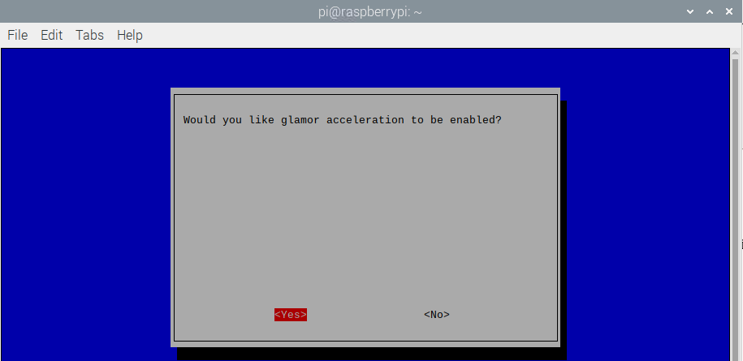

In this chapter, we will learn how to use camera.

Project TTS reminder
****************************************************************

This project uses a camera to take a picture and save it in the corresponding location.

Component List

+-------------------------------------------------+-------------------------------------------------+
| Breadboard Power Module x1                      | Jumper x3                                       |
|                                                 |                                                 |
| |power-module|                                  |  |jumper-wire|                                  |
+-----------------------------+-------------------+--------------+----------------------------------+
| Camera x1                   | Resistor 10kΩ x2                 | Push Button Switch x1            |
|                             |                                  |                                  |
|  |camera|                   |  |Resistor-10kΩ|                 |  |button-small|                  |
+-----------------------------+----------------------------------+----------------------------------+

.. |jumper-wire| image:: ../_static/imgs/jumper-wire.png
.. |camera| image:: ../_static/imgs/Battery_cable.png
.. |Resistor-10kΩ| image:: ../_static/imgs/Resistor-10kΩ.png
    :width: 20%
.. |button-small| image:: ../_static/imgs/button-small.jpg

Component knowledge
================================================================

Camera
----------------------------------------------------------------

The camera is connected to the Raspberry Pi through a 15-pin cable. There are only two sockets to connect.

Next connect the camera to the Raspberry Pi. First turn off the power switch of the Raspberry Pi and disconnect the power cord. Then connect the CSI camera with Raspberry Pi camera port. :red:`(The CSI camera must be connected or disconnected without power and the Raspberry Pi is turned off, otherwise it may burn the camera.)` It needs to be connected correctly, otherwise the camera will not work.

Circuit
================================================================

+------------------------------------------------------------------------------------------------+
|   Schematic diagram                                                                            |
|                                                                                                |
|   |camera_Sc|                                                                                  |
+------------------------------------------------------------------------------------------------+
|   Hardware connection. If you need any support,please feel free to contact us via:             |
|                                                                                                |
|   support@freenove.com                                                                         |
|                                                                                                |
|   |camera_Fr|                                                                                  |
|                                                                                                |
|   :red:`Next connect the camera cable.`                                                        |
|                                                                                                |
|   After connected, it should be as follows                                                     |
|                                                                                                |
|   Step 1                                                                                       |
|                                                                                                |
|     |camera_step1|                                                                             |
|                                                                                                |
|   Step 2                                                                                       |
|                                                                                                |
|     |camera_step2|                                                                             |
|                                                                                                |
|   The :blue:`Blue side` of cable should be toward to Servo.                                    |
|                                                                                                |
|   Connect one end of cable to camera. Please note the front and back of the cable.             |
|                                                                                                |
|   Step 3                                                                                       |
|                                                                                                |
|     |camera_step3|                                                                             |
|                                                                                                |
|   Step 4                                                                                       |
|                                                                                                |
|     |camera_step4|                                                                             |
|                                                                                                |
|   The :blue:`Blue side` of cable should be toward to Servo.                                    |
|                                                                                                |
|   Connect one end of cable to camera. Please note the front and back of the cable.             |
+------------------------------------------------------------------------------------------------+

.. |camera_Fr| image:: ../_static/imgs/camera_Fr.png

.. |camera_step2| image:: ../_static/imgs/camera_step2.png

.. |camera_step4| image:: ../_static/imgs/camera_step4.png

:red:`The CSI camera must be connected or disconnected under no power and when Raspberry Pi is shut down, or the camera may be burned.`

libcamera-apps does not work properly on Pi 0 to 3 devices when running the latest Bullseye images.

A workaround is to open a terminal, run "sudo raspi-config", navigate to "Advanced Options" and enable "Glamor" graphic acceleration. Then reboot your Pi.

.. code-block:: console

    $ sudo raspi-config

.. image:: ../_static/imgs/reboot_1.png
    :align: center

