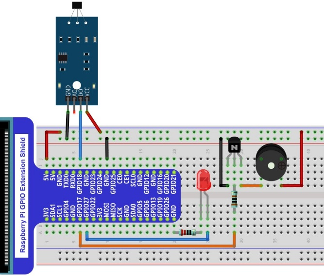
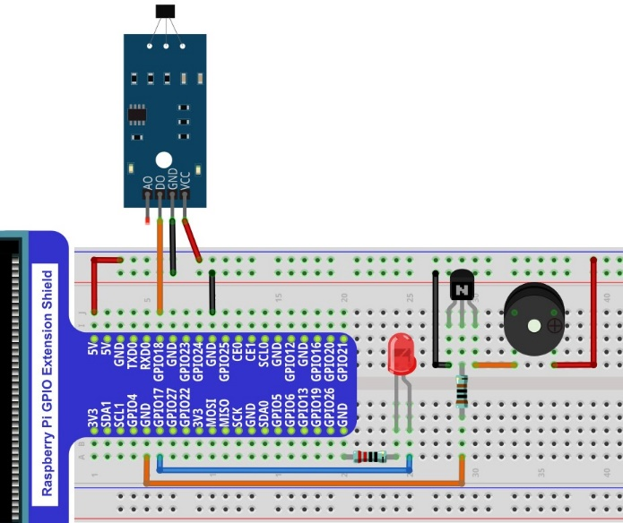

Project Hall Sensor and Buzzer
****************************************************************

This project uses Hall sensor to make a simple magnetic field detection sound and light alarm.

Component List
================================================================

+--------------------------------------------------+-------------------------------------------------+
|1. Raspberry Pi (with 40 GPIO) x1                 |                                                 |     
|                                                  | Jumper Wires x6                                 |       
|2. GPIO Extension Board & Ribbon Cable x1         |                                                 |       
|                                                  |  |jumper-wire|                                  |                                                            
|3. Breadboard x1                                  |                                                 |                                                                 
+--------------------------------------------------+-------------+-----------------------------------+
| Hall sensor x1                                   | LED x1      | NPN-transistor                    |
|                                                  |             |                                   |
|  |Hall_Sensor| :xx-large:`or` |Hall_Sensor_1|    |  |red-led|  |  |NPN-transistor|                 |                           
+-----------------------+--------------------------+-------------+----------+------------------------+
| Speaker x1            | Active buzzer x1         | Resistor 220Ω x1       | Resistor 1kΩ x1        |
|                       |                          |                        |                        |
|  |Speaker|            |  |Active-buzzer|         |  |res-220R|            |  |Resistor-1kΩ|        |                           
+-----------------------+--------------------------+------------------------+------------------------+

.. |jumper-wire| image:: ../_static/imgs/jumper-wire.png
.. |Hall_Sensor| image:: ../_static/imgs/Hall_Sensor.png
    :width: 30%
.. |Hall_Sensor_1| image:: ../_static/imgs/Hall_Sensor_1.png
    :width: 40%
.. |red-led| image:: ../_static/imgs/red-led.png
    :width: 50%
.. |res-220R| image:: ../_static/imgs/res-220R.png
    :width: 25%
.. |Speaker| image:: ../_static/imgs/Speaker.png
    :width: 60%
.. |Active-buzzer| image:: ../_static/imgs/Active-buzzer.png
    :width: 60%
.. |NPN-transistor| image:: ../_static/imgs/NPN-transistor.png
.. |Resistor-1kΩ| image:: ../_static/imgs/Resistor-1kΩ.png
    :width: 28%

:red:`For the above two hall sensors, their difference is only the pin sequence is different, please get the Hall sensor, check its sequence, change the corresponding wiring, so as not to cause permanent damage to your raspberry PI.`

Circuit
================================================================

+------------------------------------------------------------------------------------------------+
|   Schematic diagram                                                                            |
|                                                                                                |
|   |Hall_Sensor_Sc_1|                                                                           |
+------------------------------------------------------------------------------------------------+
|   Hardware connection. If you need any support,please feel free to contact us via:             |
|                                                                                                |
|   support@freenove.com                                                                         | 
|                                                                                                |
|   |Hall_Sensor_Fr_2| :xx-large:`or` |Hall_Sensor_Fr_3|                                         |
+------------------------------------------------------------------------------------------------+

.. |Hall_Sensor_Sc_1| image:: ../_static/imgs/Hall_Sensor_Sc_1.png

.. note::
    
    :red:`Please check the sequence of your Hall sensor and select the appropriate wiring to avoid permanent damage to your raspberry PI. `