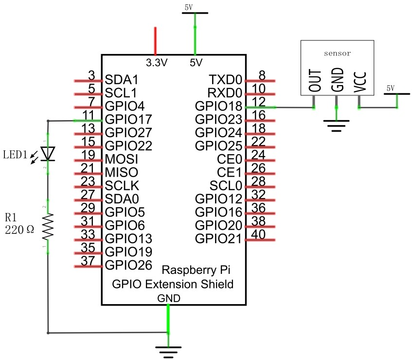
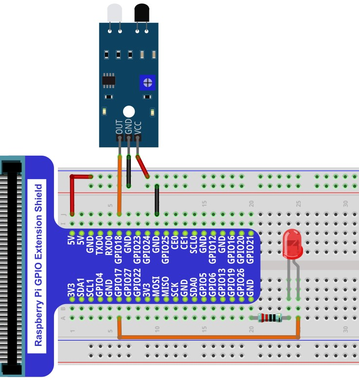

In this chapter, we will learn how to use infrared obstacle avoidance sensor.

Project Infrared obstacle avoidance sensor and LED
****************************************************************

This project uses infrared obstacle avoidance sensor to change the state of LED.

Component List
================================================================

+--------------------------------------------------+-------------------------------------------------+
|1. Raspberry Pi (with 40 GPIO) x1                 |                                                 |
|                                                  | Jumper Wires x6                                 |
|2. GPIO Extension Board & Ribbon Cable x1         |                                                 |
|                                                  |  |jumper-wire|                                  |
|3. Breadboard x1                                  |                                                 |
+--------------------------------------------------+------------------------+------------------------+
|Infrared obstacle avoidance sensor x1             | LED x1                 | Resistor 220Ω x1       |
|                                                  |                        |                        |
|  |Infrared_sensor|                               |  |red-led|             |  |res-220R|            |
+--------------------------------------------------+------------------------+------------------------+

.. |jumper-wire| image:: ../_static/imgs/jumper-wire.png
.. |Infrared_sensor| image:: ../_static/imgs/Hall_Sensor.png
    :width: 30%
.. |red-led| image:: ../_static/imgs/red-led.png
    :width: 40%
.. |res-220R| image:: ../_static/imgs/res-220R.png
    :width: 15%

Component knowledge
================================================================

Infrared obstacle avoidance sensor
----------------------------------------------------------------

The infrared obstacle avoidance sensor module is a distance adjustable obstacle avoidance sensor. The sensor has strong adaptability to ambient light and high precision. It has a pair of infrared emitting and receiving tubes. The transmitting tube emits infrared rays of a certain frequency. When the detection direction encounters an obstacle (reflecting surface), the infrared rays are reflected back and are received by the receiving tube. The indicator light is on at this time. After the circuit processing, the signal output pin outputs digital signal. The detection distance can be adjusted by the potentiometer knob, the effective distance is 2 ~ 30cm, and the detection angle is 35°. 

This module has 3 pins: signal pin, power positive pin and power negative pin. When the positive and negative pins of the module are connected to a suitable power supply, the module starts to work. At this time, only one pin on the development board is needed to read the output signal of the module. When the module is in use, the detection distance can be adjusted to a suitable value through the potentiometer knob. You can use your hand to block the module at a certain distance. When the infrared obstacle avoidance sensor is blocked, the signal pin outputs a low level; if the infrared obstacle avoidance sensor is not blocked, it outputs a high level.

Below is the pinout of infrared obstacle avoidance sensor.

**Pin description:**

.. list-table::
   :align: center
   :header-rows: 1
   :class: product-table

   * - symbol
     - Function

   * - OUT
     - Output control signal 

   * - VCC
     - Power supply pin, +3.3V~5.0V

   * - GND
     - GND

Please do not use the voltage beyond the power supply range to avoid damage to the infrared obstacle avoidance sensor.

+------------------------------------------------------------------------------------------------+
|   Schematic diagram                                                                            |
|                                                                                                |
|   |Infrared_sensor_Sc|                                                                         |
+------------------------------------------------------------------------------------------------+
|   Hardware connection. If you need any support,please feel free to contact us via:             |
|                                                                                                |
|   support@freenove.com                                                                         | 
|                                                                                                |
|   |Infrared_sensor_Fr|                                                                         |
+------------------------------------------------------------------------------------------------+

