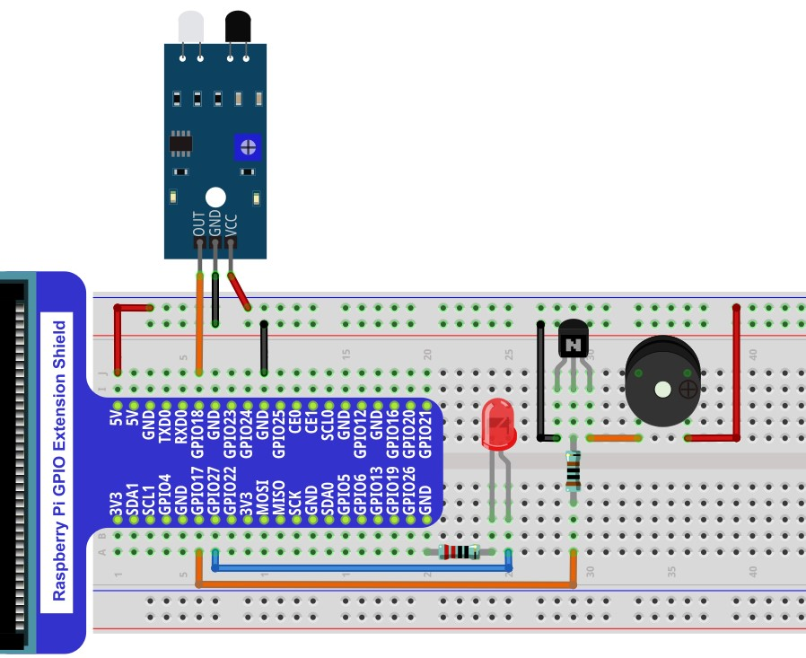

Project 30.2 Infrared obstacle avoidance sensor and buzzer
****************************************************************

This project uses an infrared obstacle avoidance sensor to make a simple reminder.

Component List
================================================================

+--------------------------------------------------+---------------------------------------------------+
|1. Raspberry Pi (with 40 GPIO) x1                 |                                                   |
|                                                  | Jumper Wires x6                                   |
|2. GPIO Extension Board & Ribbon Cable x1         |                                                   |
|                                                  |  |jumper-wire|                                    |
|3. Breadboard x1                                  |                                                   |
+--------------------------------------------------+--------------------------+------------------------+
|Active buzzer x1                                  | NPN transistorx1 (S8050) | Resistor 1kΩx1         |
|                                                  |                          |                        |
|  |Active-buzzer|                                 |  |NPN-transistor|        |  |Resistor-1kΩ|        |
+--------------------------------------------------+--------------------------+------------------------+
|Infrared obstacle avoidance sensor x1             | LED x1                   | Resistor 220Ω x1       |
|                                                  |                          |                        |
|  |Infrared_sensor|                               |  |red-led|               |  |res-220R|            |
+--------------------------------------------------+--------------------------+------------------------+

.. |jumper-wire| image:: ../_static/imgs/jumper-wire.png
.. |Infrared_sensor| image:: ../_static/imgs/Hall_Sensor.png
    :width: 30%
.. |red-led| image:: ../_static/imgs/red-led.png
    :width: 30%
.. |res-220R| image:: ../_static/imgs/res-220R.png
    :width: 25%
.. |Active-buzzer| image:: ../_static/imgs/Active-buzzer.png
    :width: 40%
.. |NPN-transistor| image:: ../_static/imgs/NPN-transistor.png
    :width: 50%
.. |Resistor-1kΩ| image:: ../_static/imgs/Resistor-1kΩ.png
    :width: 25%

Circuit
================================================================

+------------------------------------------------------------------------------------------------+
|   Schematic diagram                                                                            |
|                                                                                                |
|   |Infrared_sensor_Sc_1|                                                                       |
+------------------------------------------------------------------------------------------------+
|   Hardware connection. If you need any support,please feel free to contact us via:             |
|                                                                                                |
|   support@freenove.com                                                                         | 
|                                                                                                |
|   |Infrared_sensor_Fr_1|                                                                       |
+------------------------------------------------------------------------------------------------+

