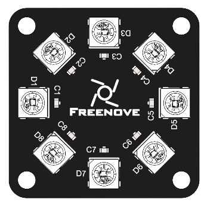
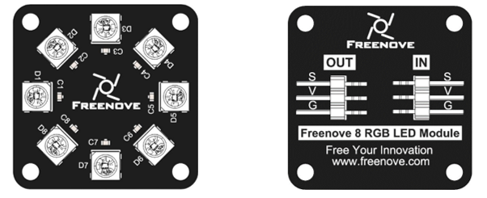

In this chapter, we will learn Freenove 8 RGB LED Module.

 .. note::

    if your Raspberry PI is :red:`Raspberry Pi5`, skip 32.1 and 32.2 and look at 32.3 instead. Because 32.1 and 32.2 use the rpi_ws2812 library, they are not compatible with Raspberry Pi5.

Project LEDpixel
****************************************************************

This project will achieve an Freenove 8 RGB LED Module flowing water.

Component List
================================================================

+--------------------------------------------------+-------------------------------------------------+
|1. Raspberry Pi (with 40 GPIO) x1                 |                                                 |
|                                                  | Jumper Wires x7                                 |
|2. GPIO Extension Board & Ribbon Cable x1         |                                                 |
|                                                  |  |jumper-wire|                                  |
|3. Breadboard x1                                  |                                                 |
+--------------------------------------------------+-------------------------------------------------+
|Freenove 8 RGB LED Module x1                                                                        |
|                                                                                                    |
|  |LEDpixel|                                                                                        |
+----------------------------------------------------------------------------------------------------+

.. |jumper-wire| image:: ../_static/imgs/jumper-wire.png

Component knowledge
================================================================

Freenove 8 RGB LED Module
----------------------------------------------------------------

The Freenove 8 RGB LED Module is as below. You can use only one data pin to control the eight LEDs on the module. As shown below:

And you can also control many modules at the same time. Just connect OUT pin of one module to IN pin of another module. In such way, you can use one data pin to control 8, 16, 32 … LEDs.

.. image:: ../_static/imgs/LEDpixel_2.png
    :align: center

+---------------------------------------+----------------------------------------+
|                  (IN)                 |                 (OUT)                  |
+========+==============================+========+===============================+
| symbol | Function                     | symbol | Function                      |
+--------+------------------------------+--------+-------------------------------+
| S      | Input control signal         | S      | Output control signal         |
+--------+------------------------------+--------+-------------------------------+
| V      | Power supply pin, +3.5V~5.5V | V      | Power supply pin, +3.5V~5.5V  |
+--------+------------------------------+--------+-------------------------------+
| G      | GND                          | G      | GND                           |
+--------+------------------------------+--------+-------------------------------+

Circuit
================================================================

+------------------------------------------------------------------------------------------------+
|   Schematic diagram                                                                            |
|                                                                                                |
|   |LEDpixel_Sc|                                                                                |
+------------------------------------------------------------------------------------------------+
|   Hardware connection. If you need any support,please feel free to contact us via:             |
|                                                                                                |
|   support@freenove.com                                                                         | 
|                                                                                                |
|   |LEDpixel_Fr|                                                                                |
+------------------------------------------------------------------------------------------------+

.. |LEDpixel_Fr| image:: ../_static/imgs/LEDpixel_Fr.png

.. _additional supplements:

Additional supplement 
================================================================

Raspbery Pi, other than 4B and 400, nees to disable the audio module, othewise the LED will not work properly.

1.	Create a new snd-blacklist.conf and open it for editing

.. code-block:: console    
    
    $ sudo nano /etc/modprobe.d/snd-blacklist.conf

Add following content: After adding the contents, you need to press Ctrl+O, Enter, Ctrl+Z.

.. code-block:: console    
    
    $ blacklist snd_bcm2835

.. image:: ../_static/imgs/black_list.png
    :align: center

2.	We also need to edit config file.

.. code-block:: console    
    
    $ sudo nano /boot/firmware/config.txt

Find the contents of the following two lines (with Ctrl + W you can search):

.. code-block:: console    
    
    $ # Enable audio (loads snd_bcm2835)
    $ dtparam=audio=on

Add # to comment out the second line. Press Ctrl+O, Enter, Ctrl+X.

.. code-block:: console    
    
    $ # Enable audio (loads snd_bcm2835)
    $ # dtparam=audio=on

.. image:: ../_static/imgs/audio.png
    :align: center

It will take effect after restarting, restart your RPi.

If you want to restart the audio module, just restore the content modified in the above two steps.

