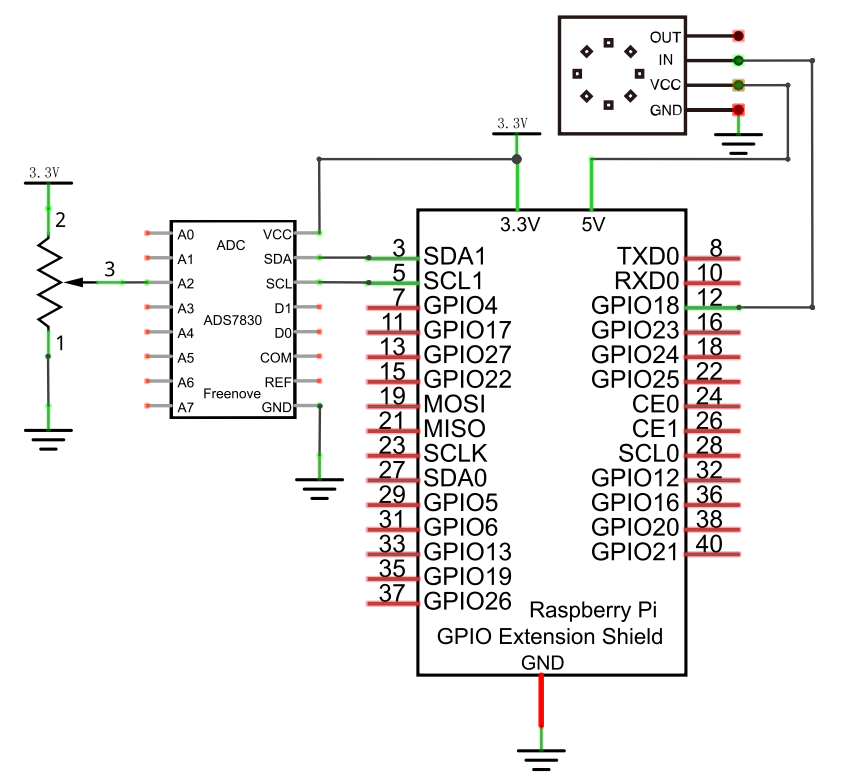
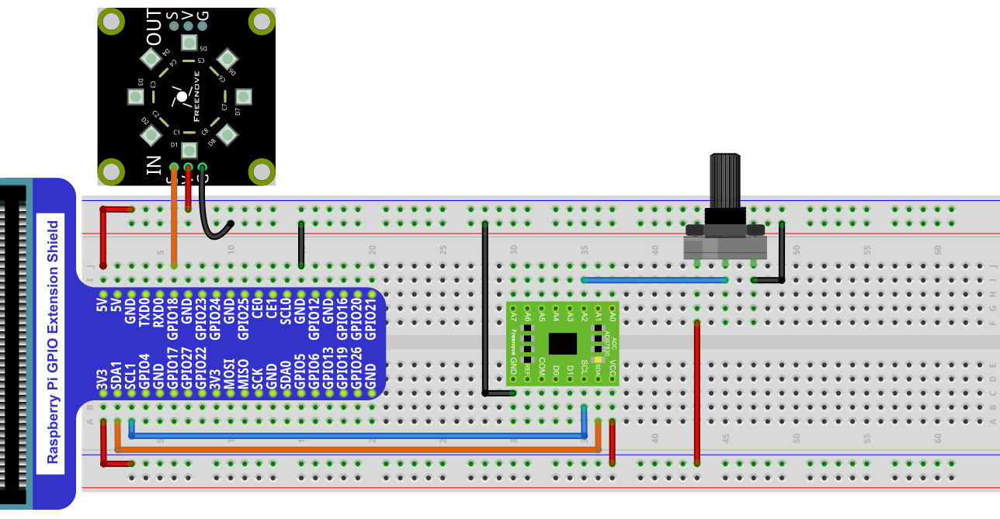

Project 32.2 RainbowLight
****************************************************************

In this project, we will learn to control the LED module with a potentiometer.

Component List
================================================================

+--------------------------------------------------+-------------------------------------------------+
|1. Raspberry Pi (with 40 GPIO) x1                 |                                                 |
|                                                  | Jumper Wires x13                                |
|2. GPIO Extension Board & Ribbon Cable x1         |                                                 |
|                                                  |  |jumper-wire|                                  |
|3. Breadboard x1                                  |                                                 |
+--------------------------------+-----------------+-------------------+-----------------------------+
|Freenove 8 RGB LED Module x1    |  Rotary Potentiometer x1            |  ADC Module x1              |
|                                |                                     |                             |
|  |LEDpixel|                    |   |Rotary-potentiometer|            |  |ADC-module-2|             |
+--------------------------------+-------------------------------------+-----------------------------+

.. |jumper-wire| image:: ../_static/imgs/jumper-wire.png
.. |LEDpixel| image:: ../_static/imgs/LEDpixel.png
    :width: 60%
.. |Rotary-potentiometer| image:: ../_static/imgs/Rotary-potentiometer.png
    :width: 60%
.. |ADC-module-2| image:: ../_static/imgs/ADC-module-2.png
    :width: 60%

Circuit
================================================================

+------------------------------------------------------------------------------------------------+
|   Schematic diagram                                                                            |
|                                                                                                |
|   |LEDpixel_Sc_1|                                                                              |
+------------------------------------------------------------------------------------------------+
|   Hardware connection. If you need any support,please feel free to contact us via:             |
|                                                                                                |
|   support@freenove.com                                                                         | 
|                                                                                                |
|   |LEDpixel_Fr_1|                                                                              |
+------------------------------------------------------------------------------------------------+

