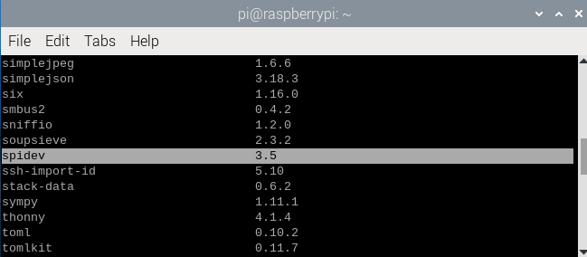

Project 32.2 SpiLEDpixel
****************************************************************

This project will control ledpixel to display any color by the Raspberry Pi's SPI.

Component List
================================================================

+--------------------------------------------------+-------------------------------------------------+
|1. Raspberry Pi (with 40 GPIO) x1                 |                                                 |
|                                                  | Jumper Wires x4                                 |
|2. GPIO Extension Board & Ribbon Cable x1         |                                                 |
|                                                  |  |jumper-wire|                                  |
|3. Breadboard x1                                  |                                                 |
+--------------------------------------------------+-------------------------------------------------+
|Freenove 8 RGB LED Module x1                                                                        |
|                                                                                                    |
|  |LEDpixel|                                                                                        |
+----------------------------------------------------------------------------------------------------+

.. |jumper-wire| image:: ../_static/imgs/jumper-wire.png
.. |LEDpixel| image:: ../_static/imgs/LEDpixel.png
    :width: 40%

Component knowledge
================================================================

Freenove 8 RGB LED Module
----------------------------------------------------------------

The Freenove 8 RGB LED Module is as below. You can use only one data pin to control the eight LEDs on the module. As shown below:

.. image:: ../_static/imgs/LEDpixel_1.png
    :align: center

And you can also control many modules at the same time. Just connect OUT pin of one module to IN pin of another module. In such way, you can use one data pin to control 8, 16, 32 … LEDs.

.. image:: ../_static/imgs/LEDpixel_2.png
    :align: center

+---------------------------------------+----------------------------------------+
|                  (IN)                 |                 (OUT)                  |
+========+==============================+========+===============================+
| symbol | Function                     | symbol | Function                      |
+--------+------------------------------+--------+-------------------------------+
| S      | Input control signal         | S      | Output control signal         |
+--------+------------------------------+--------+-------------------------------+
| V      | Power supply pin, +3.5V~5.5V | V      | Power supply pin, +3.5V~5.5V  |
+--------+------------------------------+--------+-------------------------------+
| G      | GND                          | G      | GND                           |
+--------+------------------------------+--------+-------------------------------+

Circuit
================================================================

+------------------------------------------------------------------------------------------------+
|   Schematic diagram                                                                            |
|                                                                                                |
|   |LEDpixel_Sc_2|                                                                              |
+------------------------------------------------------------------------------------------------+
|   Hardware connection. If you need any support,please feel free to contact us via:             |
|                                                                                                |
|   support@freenove.com                                                                         | 
|                                                                                                |
|   |LEDpixel_Fr_2|                                                                              |
+------------------------------------------------------------------------------------------------+

.. |LEDpixel_Sc_2| image:: ../_static/imgs/LEDpixel_Sc_2.png
.. |LEDpixel_Fr_2| image:: ../_static/imgs/LEDpixel_Fr_2.png

Before you run your python code, check that the spidev library exists.

Enter the following command to install.

.. code-block:: console    
    
    $ pip list

The spidev is installed on Raspberry PI by default. As shown in the figure below.

If your Raspberry PI system does not have this library, you can find **spidev-3.6.tar.gz** in **Freenove_Kit/Libs/Python-Libs**.

Enter the following instructions to install spidev.

.. code-block:: console    
    
    $ cd Freenove_Kit/Libs/Python-Libs
    $ tar -zxvf spidev-3.6.tar.gz
    $ cd spidev-3.6
    $ sudo python setup.py install

The installation is complete as shown in the following figure.

.. image:: ../_static/imgs/installation.png
    :align: center

.. hint:: 
    :red:`If you have any concerns, please contact us via:` support@freenove.com

Additional supplement 
================================================================

Note that the frequency of the SPI changes as the CPU frequency self-regulates, so we need to fix the cpu frequency before we start using the code. Please refer to the following operations.

1. Open the config.txt file and prepare to edit it.

.. code-block:: console    
    
    $ sudo nano /boot/firmware/config.txt

2. If your Raspberry PI is Raspberry PI 4 or Raspberry PI 5, please add at the bottom:

.. code-block:: console    
    
    $ force_turbo=1

If your Raspberry PI is Raspberry PI 3, add it at the bottom:

.. code-block:: console    
    
    $ core_freq=250

3. Save the file.

4. Turn on the spi feature of the Raspberry PI.

.. code-block:: console    
    
    $ sudo raspi-config

5. **Select Interface Options, then SPI, and turn it on**.

6. Select Finish.

7. Reboot the Raspberry PI.

.. code-block:: console    
    
    $ sudo reboot

.. image:: ../_static/imgs/SPI.png
    :align: center

.. image:: ../_static/imgs/SPI_1.png
    :align: center

.. image:: ../_static/imgs/SPI_2.png
    :align: center