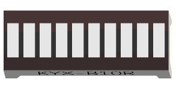
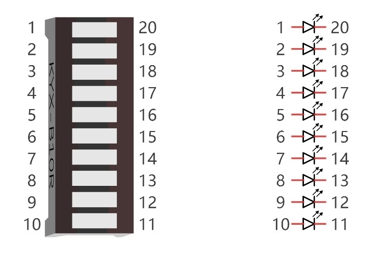
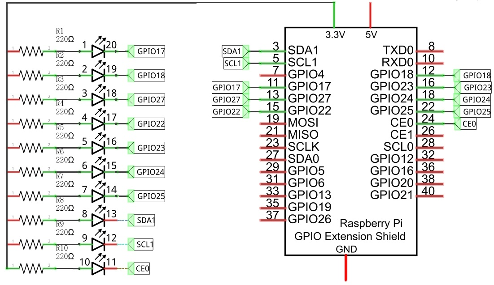
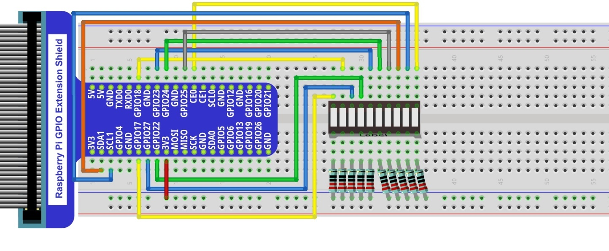

We have learned how to control one LED to blink. Next, we will learn how to control a number of LEDs

Project Flowing Water Light
****************************************************************

In this project, we use a number of LEDs to make a flowing water light.

Component List
================================================================

1. Raspberry Pi (with 40 GPIO) x1
GPIO Extension Board & Ribbon Cable x1
Breadboard x1

2. Jumper Wire

.. image:: ../_static/imgs/jumper-wire.png
        :width: 25%

3. Bar Graph LED x1

4. Resistor 220Ω x10

Component knowledge
================================================================
Let us learn about the basic features of these components to use and understand them better.

Bar Graph LED
----------------------------------------------------------------
A Bar Graph LED has 10 LEDs integrated into one compact component. The two rows of pins at its bottom are paired to identify each LED like the single LED used earlier. 

Circuit
================================================================
A reference system of labels is used in the circuit diagram below. Pins with the same network label are connected together.

Schematic diagram             

                   

Hardware connection. If you need any support, please feel free to contact us via: support@freenove.com

.. note:: 
        :red:`If LEDbar doesn't work, rotate LEDbar 180° to try. The label is random.`

.. note:: 
        **Youtube video:** https://youtu.be/3rh-b05VoiU

.. raw:: html

   <iframe height="500" width="690" src="https://www.youtube.com/embed/3rh-b05VoiU" frameborder="0" allowfullscreen></iframe>

In this circuit, the cathodes of the LEDs are connected to the GPIO, which is different from the previous circuit. The LEDs turn ON when the GPIO output is low level in the program. 
