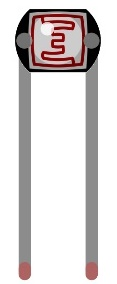
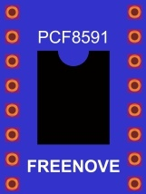
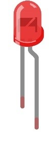
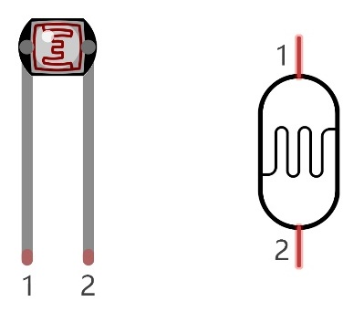
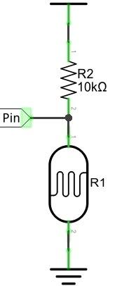
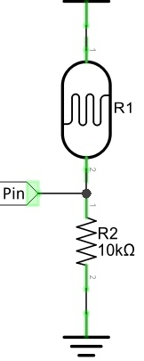
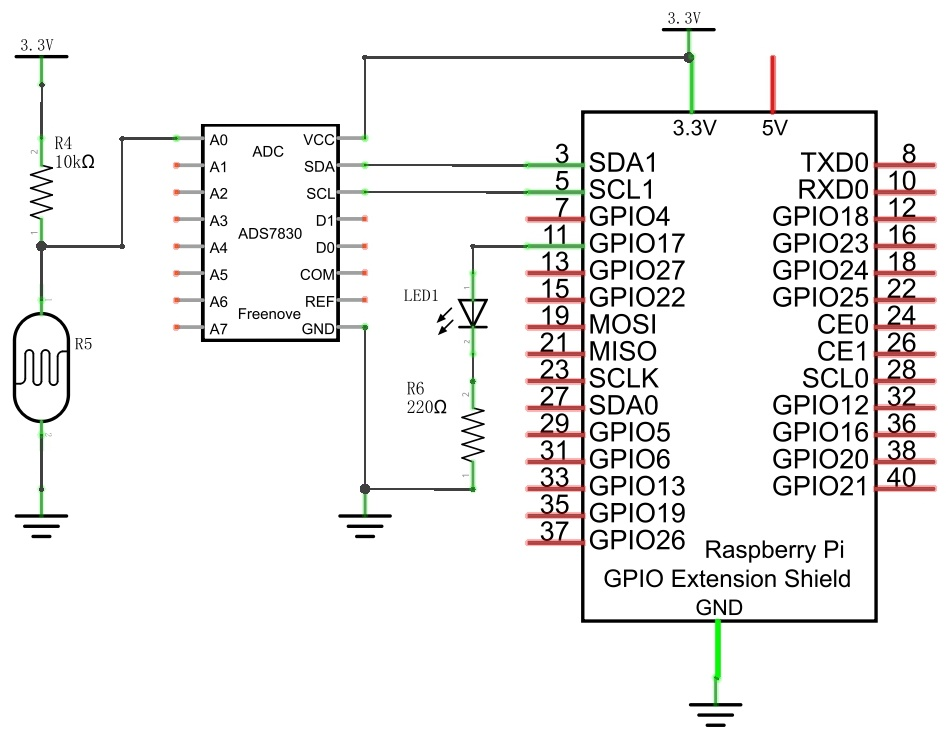
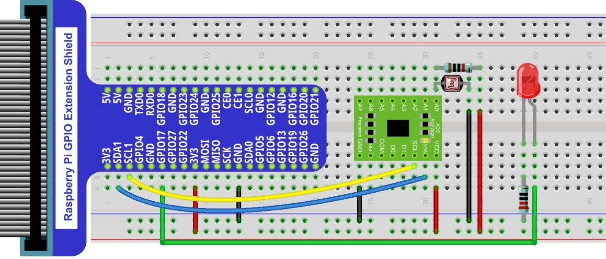
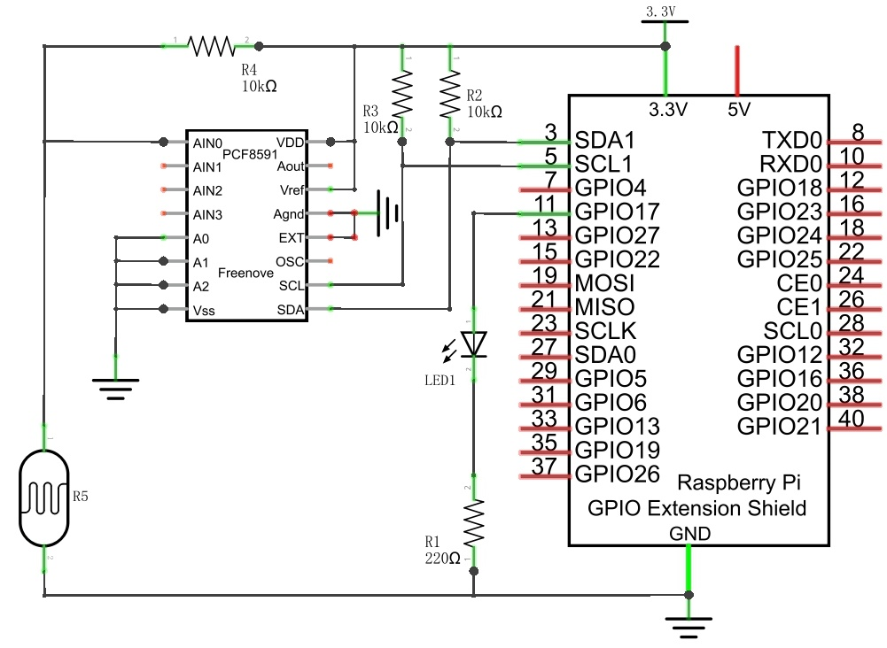
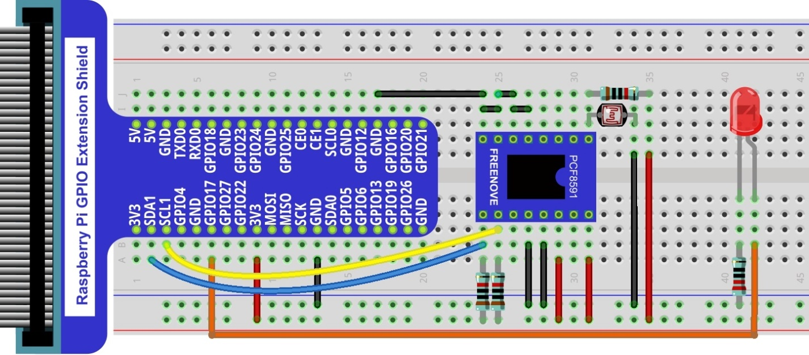

In this chapter, we will learn how to use a photoresistor to make an automatic dimming nightlight.

Project NightLamp
****************************************************************

A Photoresistor is very sensitive to the amount of light present. We can take advantage of the characteristic to make a nightlight with the following function. When the ambient light is less (darker environment), the LED will automatically become brighter to compensate and when the ambient light is greater (brighter environment) the LED will automatically dim to compensate.

Component List
================================================================

.. table:: 
    :width: 30%
    :widths: 20 20
    :align: center

+-------------------------------------------------+-------------------------------+
|1. Raspberry Pi (with 40 GPIO) x1                |   Resistor 220Ω x1            |     
|                                                 |                               |       
|2. GPIO Extension Board & Ribbon Cable x1        |   |res-220R|                  |       
|                                                 |                               |                                                            
|3. Breadboard x1                                 |                               |                                                                 
+-------------------------------------------------+-------------------------------+
| Photoresistor x1                                |   Resistor 10kΩ x3            |
|                                                 |                               |
| |Phtotresistor|                                 |  |Resistor-10kΩ|              |                           
+-------------------------------------------------+-------------------------------+
| ADC module x1 (Only one)                        |   LED x1                      |
|                                                 |                               |
| |ADC-module-1|   :xx-large:`or`  |ADC-module-2| |   |red-led|                   |                   
|                                                 |                               |  
+-------------------------------------------------+-------------------------------+
|   Jumper Wire M/M x17                                                           |
|                                                                                 | 
|      |jumper-wire|                                                              |
+---------------------------------------------------------------------------------+

.. |jumper-wire| image:: ../_static/imgs/jumper-wire.png
        :width: 40%
.. |Resistor-10kΩ| image:: ../_static/imgs/Resistor-10kΩ.png
        :width: 25%
.. |res-220R| image:: ../_static/imgs/res-220R.png
        :width: 25%

.. |ADC-module-2| image:: ../_static/imgs/ADC-module-2.png

Component knowledge
================================================================

Photoresistor
----------------------------------------------------------------

A Photoresistor is simply a light sensitive resistor. It is an active component that decreases resistance with respect to receiving luminosity (light) on the component's light sensitive surface. A Photoresistor's resistance value will change in proportion to the ambient light detected. With this characteristic, we can use a Photoresistor to detect light intensity. The Photoresistor and its electronic symbol are as follows.

The circuit below is used to detect the change of a Photoresistor's resistance value:

In the above circuit, when a Photoresistor's resistance vale changes due to a change in light intensity, the voltage between the Photoresistor and Resistor R1 will also change. Therefore, the intensity of the light can be obtained by measuring this voltage.

Circuit with ADS7830
================================================================

The circuit used is similar to the Soft light project. The only difference is that the input signal of the AIN0 pin of ADC changes from a Potentiometer to a combination of a Photoresistor and a Resistor.

+------------------------------------------------------------------------------------------------+
|   Schematic diagram                                                                            |
|                                                                                                |
|   |ADS7830-Schematic-4|                                                                        |
+------------------------------------------------------------------------------------------------+
|   Hardware connection. If you need any support,please feel free to contact us via:             |
|                                                                                                |
|   support@freenove.com                                                                         |
|                                                                                                |
|   |ADS7830-fritizing-5|                                                                        |
|                                                                                                |
|    **Video:** https://youtu.be/r6p3zhXsyko                                                     |
+------------------------------------------------------------------------------------------------+

.. raw:: html

   <iframe height="500" width="690" src="https://www.youtube.com/embed/r6p3zhXsyko" frameborder="0" allowfullscreen></iframe>

Circuit with PCF8591
================================================================

The circuit used is similar to the Soft light project. The only difference is that the input signal of the AIN0 pin of ADC changes from a Potentiometer to a combination of a Photoresistor and a Resistor.

+------------------------------------------------------------------------------------------------+
|   Schematic diagram                                                                            |
|                                                                                                |
|   |PCF8591-Schematic-4|                                                                        |
+------------------------------------------------------------------------------------------------+
|   Hardware connection.                                                                         |
|                                                                                                |
|   |PCF8591-fritizing-4|                                                                        |
+------------------------------------------------------------------------------------------------+

