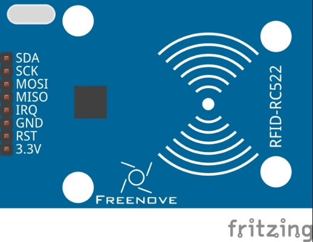
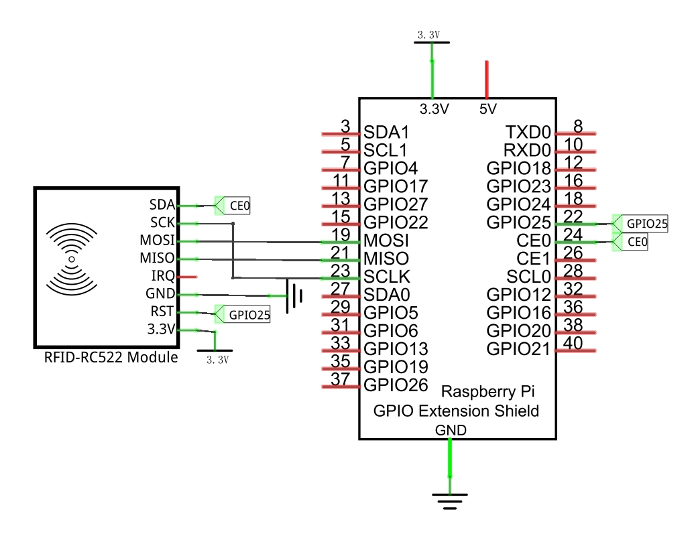
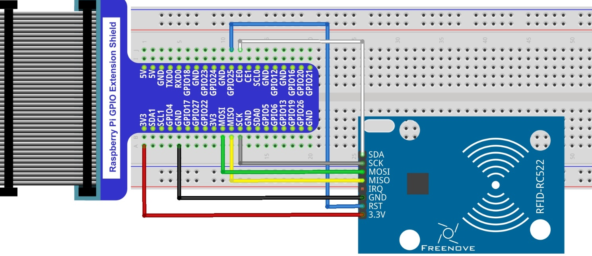
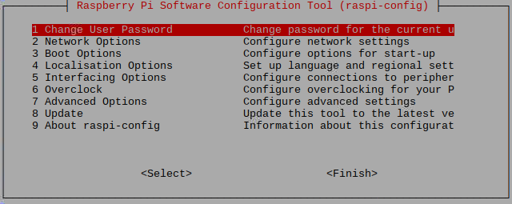

In this chapter, we will learn how to use RFID.

Project RFID
****************************************************************

In this project, we will use RC522 RFID card reader to read and write the M1-S50 card.

+--------------------------------------------------+-------------------------------------------------+
|1. Raspberry Pi (with 40 GPIO) x1                 |   RC522 module x1                               |
|                                                  |                                                 |
|2. GPIO Extension Board & Ribbon Cable x1         |                                                 |
|                                                  |    |RC522|                                      |
|3. Breadboard x1                                  |                                                 |
+--------------------------------------------------+                                                 |
|Jumper Wires x4                                   |                                                 |          
|                                                  |                                                 |  
| |jumper-wire|                                    |                                                 |  
+--------------------------------------------------+-------------------------------------------------+
|Mifare1 S50 Standard card x1                      | Mifare1 S50 Non-standard card x1                |          
|                                                  |                                                 |  
| |card|                                           |   |Non_card|                                    |  
+--------------------------------------------------+-------------------------------------------------+

.. |jumper-wire| image:: ../_static/imgs/jumper-wire.png

Component Knowledge
================================================================

RFID
----------------------------------------------------------------

RFID(Radio Frequency Identification)is a form of wireless communication technology. A complete RFID system is generally composed of a transponder and a reader. Generally, the transponder may be known as a tag, and each tag has a unique code, which is attached to an object to identify the target object. The reader is a device that reads (or writes) information in the tag.

Products derived from RFID technology can be divided into three categories: passive RFID products, active RFID products and semi active RFID products, among which, Passive RFID products are the earliest, the most mature and most widely used products in the market. It can be seen everywhere in our daily life such as, the bus card, dining card, bank card, hotel access cards, etc., and all of them are classified as close-range contact recognition. The main operating frequency of Passive RFID products are: 125KHZ (low frequency), 13.56MHZ (high frequency), 433MHZ (ultrahigh frequency), 915MHZ (ultrahigh frequency). Active and semi active RFID products work at higher frequencies.

The RFID module we use is a passive RFID product with the operating frequency of 13.56MHz.

MFRC522
----------------------------------------------------------------

The MFRC522 is a highly integrated reader/writer IC for contactless communication at 13.56MHz.

The MFRC522's internal transmitter is able to drive a reader/writer antenna designed to communicate with ISO/IEC 14443 A/MIFARE cards and transponders without additional active circuitry. The receiver module provides a robust and efficient implementation for demodulating and decoding signals from ISO/IEC 14443 A/MIFARE compatible cards and transponders. The digital module manages the complete ISO/IEC 14443A framing and error detection (parity and CRC) functionality

This RFID Module uses MFRC522 as the control chip, and SPI (Peripheral Interface Serial) as the reserved interface.

**Technical specs:**

.. list-table::
   :align: center
   :header-rows: 0
   :class: product-table

   * - Operating Voltage
     - 13-26mA(DC)\3.3V

   * - Idle current
     - 10-13mA(DC)\3.3V

   * - Sleep current in the
     - <80uA

   * - Peak current
     - <30mA

   * - Operating frequency
     - 13.56MHz

   * - Supported card type
     - Mifare1 S50、Mifare1 S70、Mifare Ultralight、Mifare Pro、Mifare Desfire

   * - Size
     - 40mmX60mm

   * - Operation temperature
     - 20-80 degrees(Celsius)

   * - Storage temperature
     - 40-85 degrees (Celsius)

   * - Operation humidity
     - 5%-95%(Relative humidity)

Mifare1 S50 Card

Mifare S50 is often called Mifare Standard with the capacity of 1K bytes. And each card has a 4-bytes global unique identifier number (USN/UID), which can be rewritten 100 thousand times and read infinite times. Its storage period can last for 10 years.

The Mifare S50 capacity (1K byte) is divided into 16 sectors (Sector0-Sector15). Each sector contains 4 data block (Block0-Block3. 64 blocks of 16 sectors will be numbered according absolute address, from 0 to 63). 

And each block contains 16 bytes (Byte0-Byte15), 64*16=1024. As is shown in the following table:

.. list-table::
   :align: center
   :header-rows: 1
   :class: product-table

   * - Sector No. 
     - Block No.
     - Storage area
     - Block type
     - Absolute block No.

   * - sector 0
     - block 0
     - vendor code
     - vendor block 
     - 0 

   * -  
     - block 1
     -  
     - data block
     - 1 

   * -  
     - block 2
     -  
     - data block 
     - 2

   * -  
     - block 3
     - Password A-access control-password B
     - control block 
     - 3 

   * - sector 1
     - block 0
     -  
     - data block 
     - 4 

   * -  
     - block 1
     - 
     - data block
     - 5

   * -  
     - block 2
     - 
     - data block
     - 6

   * - 
     - block 3
     - Password A-access control-password B
     - control block
     - 7

   * - ******
     - ****** 
     - ******
     - ******
     - ******

   * - sector 15
     - block 0
     - 
     - data block
     - 60 

   * -  
     - block 0
     -  
     - data block
     - 61 

   * -  
     - block 0
     -  
     - data block
     - 62 

   * -  
     - block 3
     - Password A-access control-password B
     - control block
     - 63
    
Each sector has a set of independent password and access control put in its last block, that is, Block 3, which is also known as sector trailer. Sector 0, block 0 (namely absolute address 0) of S50 is used to store the card serial number and vendor code, which has been solidified and can’t be changed. Except the manufacturer and the control block, the rest of the cards are data blocks, which can be used to store data. Data block can be used for two kinds of applications:

(1) used as general data storage and can be operated for reading and writing data.

(2) used as data value, and can be operated for initializing, adding, subtracting and reading the value.
The sector trailer block in each sector is the control block, including a 6-byte password A, a 4-byte access control and a 6-byte password B. For example, the control block of a brand new card is as follows:

.. list-table::
   :align: center
   :header-rows: 0
   :class: product-table

   * - A0 A1 A2 A3 A4 A5
     - FF 07 80 69
     - B0 B1 B2 B3 B4 B5

   * - password A
     - access control
     - password B

The default password of a brand new card is generally 0A1A2A3A4A5 for password A and B0B1B2B3B4B5 for password B, or both the password A and password B are 6 FF. Access control is used to set the access conditions for each block (including the control block itself) in a sector.

For more details about how to set data blocks and control blocks, please refer to Datasheet.
By default, after verifying password A or password B, we can do reading or writing operation to data blocks. And after verifying password A, we can do reading or writing operation to control blocks. But password A can never be read, so if you choose to verify password A but forget the password A, the block will never be able to read again.

.. hint:: 
    :red:`If you have any concerns, please contact us via:` support@freenove.com

For Mifare1 S50 card equipped in Freenove RFID Kit, the default password A and B are both FFFFFFFFFFFF. 

+------------------------------------------------------------------------------------------------+
|   Schematic diagram                                                                            |
|                                                                                                |
|   |RFID_Sc|                                                                                    |
+------------------------------------------------------------------------------------------------+
|   Hardware connection. If you need any support,please feel free to contact us via:             |
|                                                                                                |
|   support@freenove.com                                                                         | 
|                                                                                                |
|   |RFID_Fr|                                                                                    |
+------------------------------------------------------------------------------------------------+

Configure SPI
================================================================

Enable SPI
----------------------------------------------------------------

The SPI interface of raspberry pi is closed by default. You need to open it manually. You can enable the SPI interface in the following way.

.. code-block:: console    
    
    $ Type the following command in the terminal:

Then open the following dialog box:

Choose "5 Interfacing Options"->"P4 SPI"->"Yes"->"Finish” in order and then restart your RPi. Then the SPI module is started.

Type the following command to check whether the module SPI is loaded successfully:

.. code-block:: console    
    
    $ ls /dev/sp*

The following result indicates that the module SPI has been loaded successfully:

