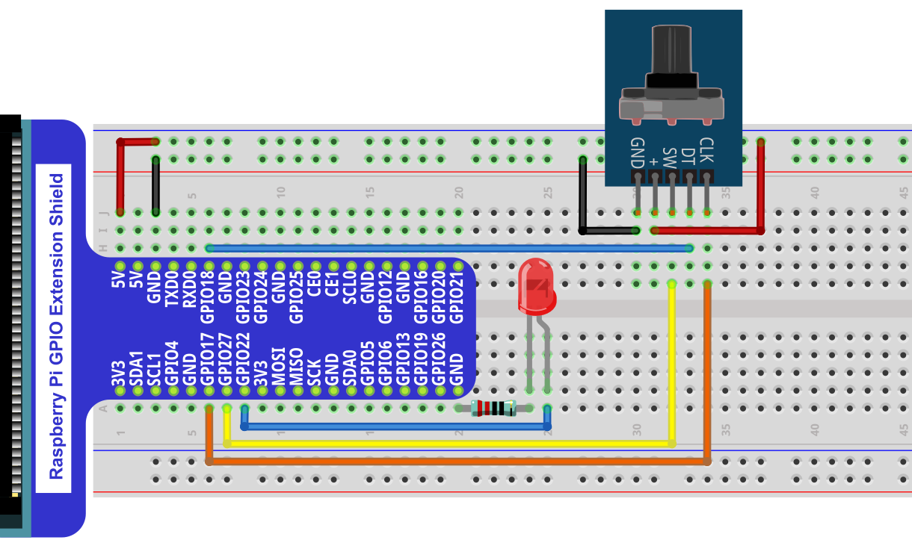

Project Rotary Encoder
****************************************************************

This project uses a rotary encoder to adjust the LEDs to emit different brightness.

Component List
================================================================

+--------------------------------------------------+-------------------------------------------------+
|1. Raspberry Pi (with 40 GPIO) x1                 |                                                 |
|                                                  | Jumper Wires x8                                 |
|2. GPIO Extension Board & Ribbon Cable x1         |                                                 |
|                                                  |  |jumper-wire|                                  |
|3. Breadboard x1                                  |                                                 |
+-----------------------------+--------------------+------------------+------------------------------+
|Rotary encoder x1            |  LED x1                               |  Resistor 220Ω x1            |
|                             |                                       |                              |
|  |Rotary_encoder|           |   |red-led|                           |   |res-220R|                 |
+-----------------------------+---------------------------------------+------------------------------+

.. |jumper-wire| image:: ../_static/imgs/jumper-wire.png
.. |Rotary_encoder| image:: ../_static/imgs/Rotary_encoder.png
    :width: 40%
.. |red-led| image:: ../_static/imgs/red-led.png
    :width: 50%
.. |res-220R| image:: ../_static/imgs/res-220R.png
    :width: 15%

Circuit
================================================================

+------------------------------------------------------------------------------------------------+
|   Schematic diagram                                                                            |
|                                                                                                |
|   |Rotary_encoder_Sc_1|                                                                        |
+------------------------------------------------------------------------------------------------+
|   Hardware connection. If you need any support,please feel free to contact us via:             |
|                                                                                                |
|   support@freenove.com                                                                         | 
|                                                                                                |
|   |Rotary_encoder_Fr_1|                                                                        |
+------------------------------------------------------------------------------------------------+

.. |Rotary_encoder_Sc_1| image:: ../_static/imgs/Rotary_encoder_Sc_1.png
