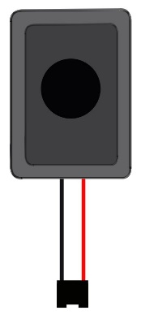

Project 35.2 TTS reminder
****************************************************************

This project uses the speaker amplifier module PAM8403 to make a TTS reminder.

Component List
================================================================

+-------------------------------------------------+-------------------------------------------------+
|1. Raspberry Pi (with 40 GPIO) x1                |                                                 |
|                                                 |   Jumper Wires                                  |
|2. GPIO Extension Board & Ribbon Cable x1        |                                                 |
|                                                 |     |jumper-wire|                               | 
|3. Breadboard x1                                 |                                                 |
+-------------------------------------------------+-------------------------------------------------+
| Breadboard Power Module x1                      | 9V Battery (you provide) & 9V Battery Cable     |
|                                                 |                                                 |
| |power-module|                                  |  |Battery_cable|                                |
+-----------------------------+-------------------+--------------+----------------------------------+
| Speaker amplifier           | Speaker x2                       | Audio cable x1                   |
|                             |                                  |                                  |
| module PAM8403 x1           |                                  |                                  |
|                             |                                  |                                  |
|  |PAM8403|                  |  |Speaker|                       |  |Audio_cable|                   |
+-----------------------------+----------------------------------+----------------------------------+
| Infrared_sensor                                                                                   |
|                                                                                                   |
|  |Infrared_sensor|                                                                                |
+---------------------------------------------------------------------------------------------------+
.. |jumper-wire| image:: ../_static/imgs/jumper-wire.png
.. |power-module| image:: ../_static/imgs/power-module.png
    :width: 70%
.. |Battery_cable| image:: ../_static/imgs/Battery_cable.png

.. |PAM8403| image:: ../_static/imgs/PAM8403.png
    :width: 60%
.. |Audio_cable| image:: ../_static/imgs/Audio_cable.png

    
Component knowledge
================================================================

TTS
----------------------------------------------------------------

TTS, short for Text To Speech, is part of the human-machine dialogue that enables machines to speak. TTS can intelligently convert text into natural speech stream. TTS technology converts text files in real time, and the conversion time is fast. In theproject, TTS was used to broadcast the text "Hello, please stay away".

Circuit
================================================================

+------------------------------------------------------------------------------------------------+
|   Schematic diagram                                                                            |
|                                                                                                |
|   |TTS_Sc|                                                                                     |
+------------------------------------------------------------------------------------------------+
|   Hardware connection. If you need any support,please feel free to contact us via:             |
|                                                                                                |
|   support@freenove.com                                                                         | 
|                                                                                                |
|   |TTS_Fr|                                                                                     |
|                                                                                                |
|   For the connection steps of the speaker amplifier module PAM8403, please refer to            |
|                                                                                                |
|   :ref:`Project 35.1 play local music`                                                         |
+------------------------------------------------------------------------------------------------+

