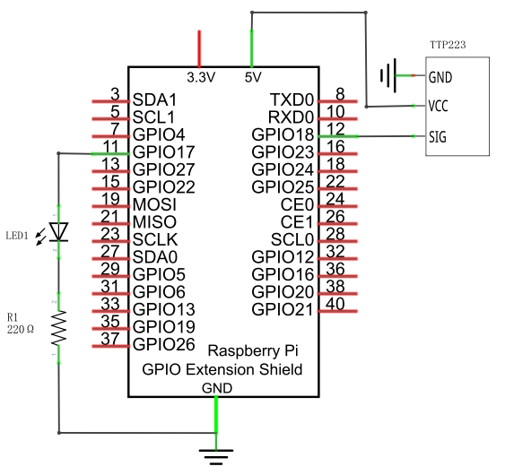
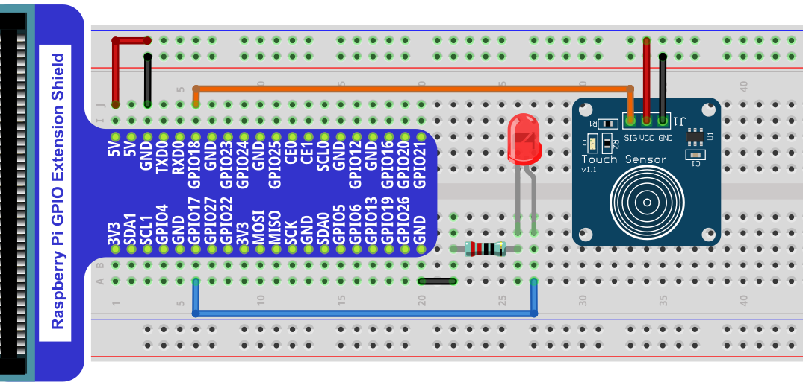

In this chapter, we will learn how to use the touch sensor.

Project 27.1 Touch Sensor and LED
****************************************************************

This project will use the touch sensor to control the LED to emit different brightness.

Component List
================================================================

+-------------------------------------------------+-------------------------------------------------+
|1. Raspberry Pi (with 40 GPIO) x1                |                                                 |     
|                                                 | Jumper Wires x7                                 |       
|2. GPIO Extension Board & Ribbon Cable x1        |                                                 |       
|                                                 |  |jumper-wire|                                  |                                                            
|3. Breadboard x1                                 |                                                 |                                                                 
+---------------------------------------+---------+------------------------+------------------------+
| TTP223 Touch Sensor x1                | LED x1                           | Resistor 220Ω x1       |     
|                                       |                                  |                        |       
|  |TTP223|                             | |red-led|                        | |res-220R|             |       
+---------------------------------------+----------------------------------+------------------------+

.. |jumper-wire| image:: ../_static/imgs/jumper-wire.png
.. |TTP223| image:: ../_static/imgs/TTP223.png
.. |res-220R| image:: ../_static/imgs/res-220R.png
.. |red-led| image:: ../_static/imgs/red-led.png

Component knowledge
================================================================

Touch Sensor
----------------------------------------------------------------

The touch sensor module is a capacitive touch switch module based on TTP223 chip. Its use is very simple. This module has 3 pins: signal pin, power positive pin and power negative pin. When the positive and negative pins of the module are connected to a suitable power supply, the module starts to work. At this time, only one pin on the development board is needed to read the output signal of the module. For example, you can touch the front and back of the module. When the touch sensor is touched, the signal pin outputs a high level; when the touch sensor is not touched, it outputs a low level.

Below is the pinout of the touch sensor.

**Pin description:**

.. list-table::
   :align: center
   :header-rows: 1
   :class: product-table

   * - symbol
     - Function

   * - SIG
     - Output control signal 

   * - VCC
     - Power supply pin, +2.0V~5.5V

   * - GND
     - GND

Please do not use voltage beyond the power supply range to avoid damage to the touch sensor.

Circuit
================================================================

+------------------------------------------------------------------------------------------------+
|   Schematic diagram                                                                            |
|                                                                                                |
|   |TTP223_Sc|                                                                                  |
+------------------------------------------------------------------------------------------------+
|   Hardware connection. If you need any support,please feel free to contact us via:             |
|                                                                                                |
|   support@freenove.com                                                                         | 
|                                                                                                |
|   |TTP223_Fr|                                                                                  |
+------------------------------------------------------------------------------------------------+

