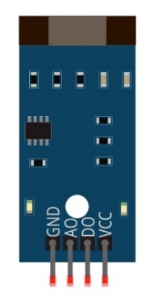
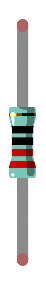

In this chapter, we will learn how to use a U-shaped photoelectric sensor.

Project U-shaped photoelectric sensor and LED
****************************************************************

This project uses a U-shaped photoelectric sensor to control the state of the LED.	

Component List
================================================================

+-------------------------------------------------+---------------------------------------------------+
|1. Raspberry Pi (with 40 GPIO) x1                |                                                   |     
|                                                 | Jumper Wires x6                                   |       
|2. GPIO Extension Board & Ribbon Cable x1        |                                                   |       
|                                                 |  |jumper-wire|                                    |                                                            
|3. Breadboard x1                                 |                                                   |                                                                 
+-------------------------------------------------+-------------------------+-------------------------+
| TTP223 Touch Sensor x1                          | LED x1                  | Resistor 220Ω x1        |   
|                                                 |                         |                         |       
| |photoelectric| :xx-large:`or` |photoelectric_1||  |red-led|              | |res-220R|              |       
+-------------------------------------------------+-------------------------+-------------------------+

.. |jumper-wire| image:: ../_static/imgs/jumper-wire.png

.. |photoelectric_1| image:: ../_static/imgs/photoelectric_1.png
    :width: 30%

.. |red-led| image:: ../_static/imgs/red-led.png
    :width: 50%

Component knowledge
================================================================

U-shaped photoelectric sensor
----------------------------------------------------------------

The U-shaped photoelectric sensor is a through-beam photoelectric sensor, which consists of a transmitting end and a receiving end. Its working principle is blocking and conducting the infrared emission light will change the current induced by the infrared receiving tube. 

This module has 4 pins: digital output (DO), analog output (AO), power supply positive pin and power supply negative pin. When the positive and negative pins of the module are connected to a suitable power supply, the module starts to work. Only one pin on the development board is needed to read the digital output (DO) signal of the module. When the photoelectric sensor is blocked, the digital signal pin outputs a low level. If the photoelectric sensor is not blocked, it outputs a high level.
Below is the pinout of the touch sensor.

Below is the pinout of the touch sensor.

**Pin description:**

.. list-table::
   :align: center
   :header-rows: 1
   :class: product-table

   * - symbol
     - Function

   * - VCC
     - Power supply pin, +3.3V~5.5V  

   * - DO
     - Output control signal(High or low level)

   * - GND
     - GND

:red:`Please do not use the voltage beyond the power supply range to avoid damage to the U-shaped photoelectric sensor.`

:red:`The difference between the above two U-type photoelectric sensors is that in addition to the different pin sequence, the output signal is opposite when you block it, that is, there are modules that output high level and low level U-type photoelectric sensor. The specific module is subject to the one in your hand. Please check the pin sequence of your U-shaped photoelectric sensor and replace the appropriate wiring to avoid permanent damage to your raspberry PI.`

Circuit
================================================================

+------------------------------------------------------------------------------------------------+
|   Schematic diagram                                                                            |
|                                                                                                |
|   |photoelectric_Sc|                                                                           |
+------------------------------------------------------------------------------------------------+
|   Hardware connection. If you need any support,please feel free to contact us via:             |
|                                                                                                |
|   support@freenove.com                                                                         | 
|                                                                                                |
|   |photoelectric_Fr|                                                                           |
+------------------------------------------------------------------------------------------------+

.. |photoelectric_Fr| image:: ../_static/imgs/photoelectric_Fr.png

.. note::
    
    :red:`Please check the sequence of your U-shaped photoelectric sensor and select the appropriate wiring to avoid permanent damage to your raspberry PI.`

