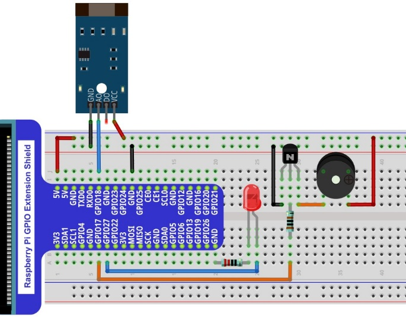

Project 28.2 U-shaped photoelectric sensor and buzzer
****************************************************************

This project uses U-shaped photoelectric sensor to make a simple sound and light alarm. 

Component List
================================================================

+------------------------------------------------------------+-------------------------------------------------+
|1. Raspberry Pi (with 40 GPIO) x1                           |                                                 |     
|                                                            | Jumper Wires x10                                |       
|2. GPIO Extension Board & Ribbon Cable x1                   |                                                 |       
|                                                            |  |jumper-wire|                                  |                                                            
|3. Breadboard x1                                            |                                                 |                                                                 
+--------------------------------------------------+---------+------------------------+------------------------+
| Active buzzer x1                                 | NPN transistorx1 (S8050)         | Resistor 1kΩx1         |     
|                                                  |                                  |                        |       
|  |Active-buzzer|                                 | |NPN-transistor|                 | |Resistor-1kΩ|         |       
+--------------------------------------------------+----------------------------------+------------------------+
| U-shaped photoelectric sensor x1                 | LED x1                           | Resistor 220Ω x1       |     
|                                                  |                                  |                        |       
| |photoelectric| :xx-large:`or` |photoelectric_1| | |red-led|                        | |res-220R|             |       
+--------------------------------------------------+----------------------------------+------------------------+

.. |jumper-wire| image:: ../_static/imgs/jumper-wire.png
.. |Active-buzzer| image:: ../_static/imgs/Active-buzzer.png
    :width: 40%
.. |res-220R| image:: ../_static/imgs/res-220R.png
    :width: 20%
.. |NPN-transistor| image:: ../_static/imgs/NPN-transistor.png
    :width: 45%
.. |Resistor-1kΩ| image:: ../_static/imgs/Resistor-1kΩ.png
    :width: 20%
.. |photoelectric| image:: ../_static/imgs/photoelectric.png
    :width: 34%

.. |red-led| image:: ../_static/imgs/red-led.png
    :width: 30%

Circuit
================================================================

+------------------------------------------------------------------------------------------------+
|   Schematic diagram                                                                            |
|                                                                                                |
|   |photoelectric_Sc_1|                                                                         |
+------------------------------------------------------------------------------------------------+
|   Hardware connection. If you need any support,please feel free to contact us via:             |
|                                                                                                |
|   support@freenove.com                                                                         | 
|                                                                                                |
|   |photoelectric_Fr_2|    :xx-large:`or`  |photoelectric_Fr_3|                                 |
+------------------------------------------------------------------------------------------------+

.. |photoelectric_Sc_1| image:: ../_static/imgs/photoelectric_Sc_1.png

.. |photoelectric_Fr_3| image:: ../_static/imgs/photoelectric_Fr_3.png
    :width: 48%

.. note::
    
    :red:`Please check the sequence of your U-shaped photoelectric sensor and select the appropriate wiring to avoid permanent damage to your raspberry PI.`
