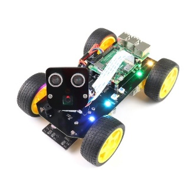
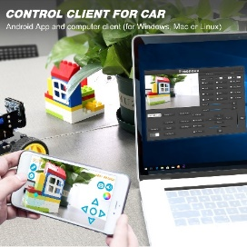
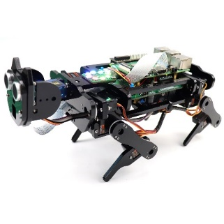
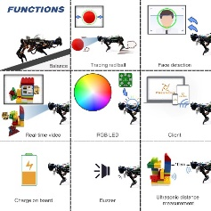
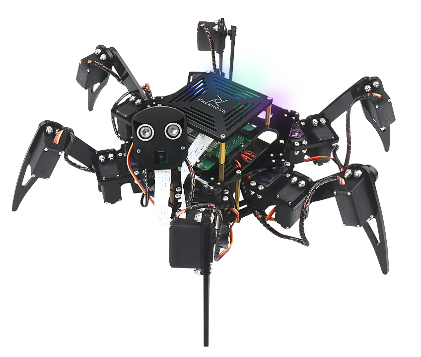
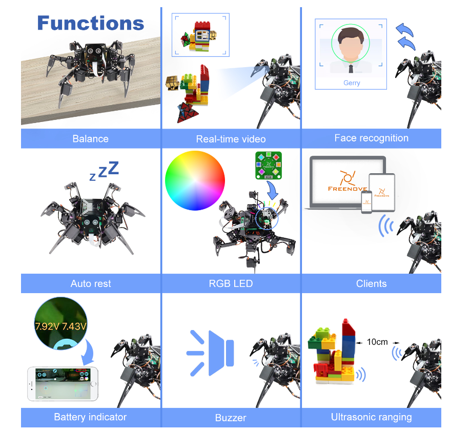

Freenove Car, Robot and other products for Raspberry Pi
================================================================

We also have car and robot kits for Raspberry Pi. You can visit our website for details.

:xx-large:`https://www.amazon.com/freenove`

**FNK0043**--:green:`Freenove 4WD Smart Car Kit for Raspberry Pi`

.. raw:: html

   <iframe height="500" width="690" src="https://www.youtube.com/embed/4Zv0GZUQjZc" frameborder="0" allowfullscreen></iframe>
  
**FNK0050**--:green:`Freenove Robot Dog Kit for Raspberry Pi`

.. raw:: html

   <iframe height="500" width="690" src="https://www.youtube.com/embed/7BmIZ8_R9d4" frameborder="0" allowfullscreen></iframe>

**FNK0052**--:green:`Freenove_Big_Hexapod_Robot_Kit_for_Raspberry_Pi`

.. raw:: html

   <iframe height="500" width="690" src="https://www.youtube.com/embed/LvghnJ2DNZ0" frameborder="0" allowfullscreen></iframe>Freenove Car, Robot and other products for Raspberry Pi
================================================================

We also have car and robot kits for Raspberry Pi. You can visit our website for details.

:xx-large:`https://www.amazon.com/freenove`

**FNK0043**--:green:`Freenove 4WD Smart Car Kit for Raspberry Pi`

.. raw:: html

   <iframe height="500" width="690" src="https://www.youtube.com/embed/4Zv0GZUQjZc" frameborder="0" allowfullscreen></iframe>
  
**FNK0050**--:green:`Freenove Robot Dog Kit for Raspberry Pi`

.. raw:: html

   <iframe height="500" width="690" src="https://www.youtube.com/embed/7BmIZ8_R9d4" frameborder="0" allowfullscreen></iframe>

**FNK0052**--:green:`Freenove_Big_Hexapod_Robot_Kit_for_Raspberry_Pi`

.. raw:: html

   <iframe height="500" width="690" src="https://www.youtube.com/embed/LvghnJ2DNZ0" frameborder="0" allowfullscreen></iframe>