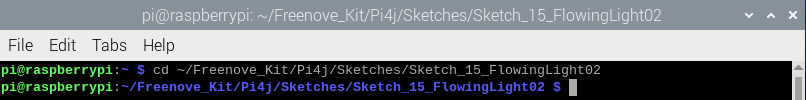
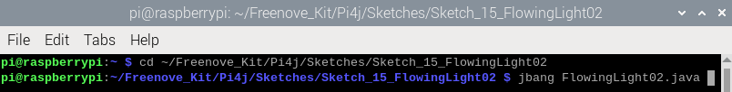
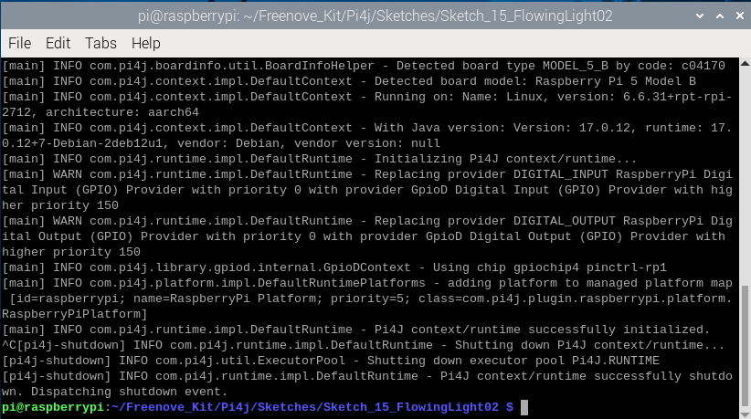
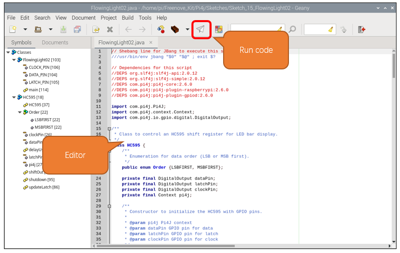

##############################################################################
Chapter 74HC595 & Bar Graph LED
##############################################################################

.. include:: ../common/com.74HC595 & Bar Graph LED.rst

Sketch
================================================================

In this chapter, we will learn how to drive the LED Bar by expanding the chip.

Sketch_15_FlowingLight02
----------------------------------------------------------------

First, enter where the project is located:

.. code-block:: console
    
    $ cd ~/Freenove_Kit/Pi4j/Sketches/Sketch_15_FlowingLight02

Enter the command to run the code.

.. code-block:: console
    
    $ jbang FlowingLight02.java

When the code is running, you can see the LEDs of the LED bar light up in a flowing water pattern.

Press Ctrl+C to exit the program.

You can run the following command to open the code with Geany to view and edit it.

.. code-block:: console
    
    $ geany FlowingLight02.java

Click the icon to run the code.

If the code fails to run, please check :doc:`Geany Configuration`.

The following is program code:

.. literalinclude:: ../../../freenove_Kit/Pi4j/Sketches/Sketch_15_FlowingLight02/FlowingLight02.java
    :linenos: 
    :language: java

Define the data transfer order for enumeration types.

.. code-block:: python

    public enum Order {LSBFIRST, MSBFIRST};  

Define the data pin, latch pin, clock pin, and Pi4j context.

.. literalinclude:: ../../../freenove_Kit/Pi4j/Sketches/Sketch_15_FlowingLight02/FlowingLight02.java
    :linenos: 
    :language: java
    :lines: 15-18

Constructor, initialize pins and context.

.. literalinclude:: ../../../freenove_Kit/Pi4j/Sketches/Sketch_15_FlowingLight02/FlowingLight02.java
    :linenos: 
    :language: java
    :lines: 20-25

Delay function in microsecond.

.. literalinclude:: ../../../freenove_Kit/Pi4j/Sketches/Sketch_15_FlowingLight02/FlowingLight02.java
    :linenos: 
    :language: java
    :lines: 27-32

Shift function for expansion chip. The Raspberry Pi sends data to the extended chip through GPIO.

.. literalinclude:: ../../../freenove_Kit/Pi4j/Sketches/Sketch_15_FlowingLight02/FlowingLight02.java
    :linenos: 
    :language: java
    :lines: 34-53

Update the expansion chip latch to let the expansion chip output the signal. Usually you need to first call the shiftOut function to input data to the expansion chip, and then call the updateLatch function to have the expansion chip output the signal level corresponding to the data.

.. literalinclude:: ../../../freenove_Kit/Pi4j/Sketches/Sketch_15_FlowingLight02/FlowingLight02.java
    :linenos: 
    :language: java
    :lines: 55-59

When Pi4j context is not used, shut it down to release resources.

.. literalinclude:: ../../../freenove_Kit/Pi4j/Sketches/Sketch_15_FlowingLight02/FlowingLight02.java
    :linenos: 
    :language: java
    :lines: 61-63

Define the pin number of the driver expansion chip.

.. literalinclude:: ../../../freenove_Kit/Pi4j/Sketches/Sketch_15_FlowingLight02/FlowingLight02.java
    :linenos: 
    :language: java
    :lines: 67-69

Create a pi4j automatic context and create an HC595 instance.

.. literalinclude:: ../../../freenove_Kit/Pi4j/Sketches/Sketch_15_FlowingLight02/FlowingLight02.java
    :linenos: 
    :language: java
    :lines: 72-73

The Raspberry Pi controls the LED bar to flow from left to right and then from right to left.

.. literalinclude:: ../../../freenove_Kit/Pi4j/Sketches/Sketch_15_FlowingLight02/FlowingLight02.java
    :linenos: 
    :language: java
    :lines: 77-95

Shutdown HC595 instance resources.

.. literalinclude:: ../../../freenove_Kit/Pi4j/Sketches/Sketch_15_FlowingLight02/FlowingLight02.java
    :linenos: 
    :language: java
    :lines: 96-98
