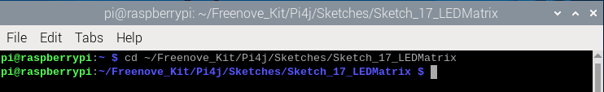
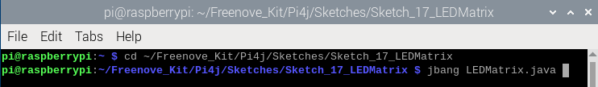
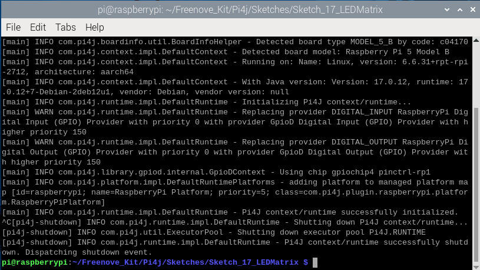

##############################################################################
Chapter 74HC595 & LED Matrix
##############################################################################

.. include:: ../common/com.74HC595 & LED Matrix.rst

Sketch
================================================================

In this project, we will drive the LED matrix to display different contents.

Sketch_17_LEDMatrix
----------------------------------------------------------------

First, enter where the project is located:

.. code-block:: console

    $ cd ~/Freenove_Kit/Pi4j/Sketches/Sketch_17_LEDMatrix
    

Enter the command to run the code.

.. code-block:: console

    $ jbang LEDMatrix.java

When the code is running, you can see that the LED matrix first displays a smiley face, then scrolls through the characters 0-F, and repeats this process in a continuous loop.

Press Ctrl+C to exit the program.

You can run the following command to open the code with Geany to view and edit it.

.. code-block:: console

    $ geany LEDMatrix.java

Click the icon to run the code.

If the code fails to run, please check :doc:`Geany Configuration`.

The following is program code:

.. literalinclude:: ../../../freenove_Kit/Pi4j/Sketches/Sketch_17_LEDMatrix/LEDMatrix.java
    :linenos: 
    :language: java

Define the contents displayed on the LED matrix.

.. literalinclude:: ../../../freenove_Kit/Pi4j/Sketches/Sketch_17_LEDMatrix/LEDMatrix.java
    :linenos: 
    :language: java
    :lines: 105-125

Use 2 nested for functions to make the LED dot matrix display a smiley face and loop it 500 times.

.. literalinclude:: ../../../freenove_Kit/Pi4j/Sketches/Sketch_17_LEDMatrix/LEDMatrix.java
    :linenos: 
    :language: java
    :lines: 133-142

Display the array from character 0 and loop 10 times to ensure that it is visible to human eyes then move the array elements one by one to make the characters scroll.

.. literalinclude:: ../../../freenove_Kit/Pi4j/Sketches/Sketch_17_LEDMatrix/LEDMatrix.java
    :linenos: 
    :language: java
    :lines: 143-154