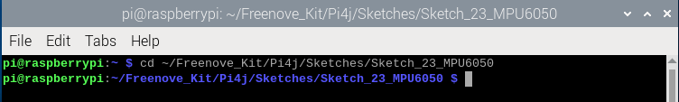
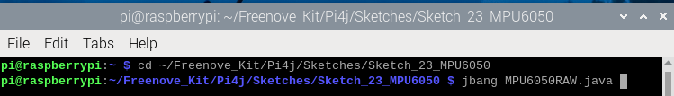
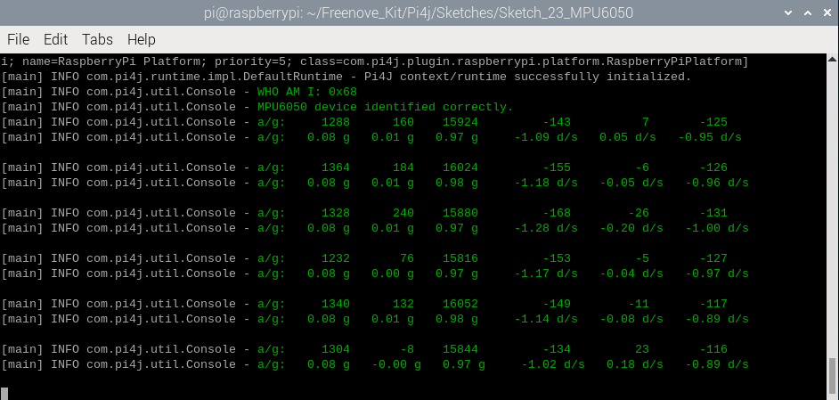
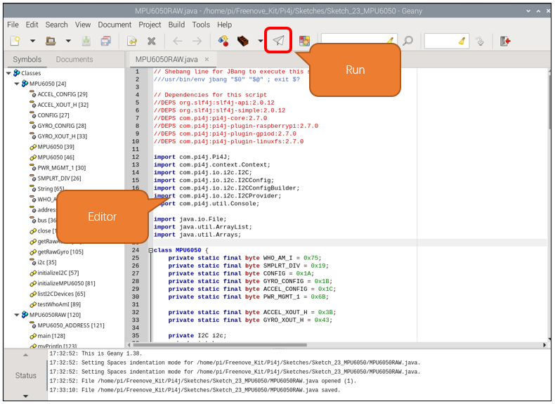

##############################################################################
Chapter Attitude Sensor MPU6050
##############################################################################

.. include:: ../common/com.Attitude Sensor MPU6050.rst

Sketch
================================================================

In this chapter, we will learn to obtain MPU6050 data and print them.

Sketch_23_MPU6050
----------------------------------------------------------------

First, enter where the project is located:

.. code-block:: console

    $ cd ~/Freenove_Kit/Pi4j/Sketches/Sketch_23_MPU6050

Enter the command to run the code.

.. code-block:: console

    $ jbang MPU6050RAW.java

When the code is running, pick up the entire board with and make any movements such as shaking it left and right, turning it upside down, etc. You can observe the changes in data on the terminal interface.

Press Ctrl+C to exit the program.

You can run the following command to open the code with Geany to view and edit it.

.. code-block:: console

    $ geany MPU6050RAW.java

Click the icon to run the code.

If the code fails to run, please check :doc:`Geany Configuration`.

The following is program code:

.. literalinclude:: ../../../freenove_Kit/Pi4j/Sketches/Sketch_23_MPU6050/MPU6050RAW.java
    :linenos: 
    :language: java

Define the commonly used registers of MPU6050.

.. literalinclude:: ../../../freenove_Kit/Pi4j/Sketches/Sketch_23_MPU6050/MPU6050RAW.java
    :linenos: 
    :language: java
    :lines: 28-36

Initialize the I2C interface of the Raspberry Pi.

.. literalinclude:: ../../../freenove_Kit/Pi4j/Sketches/Sketch_23_MPU6050/MPU6050RAW.java
    :linenos: 
    :language: java
    :lines: 63-69

Configure MPU6050 so that it can work properly.

.. literalinclude:: ../../../freenove_Kit/Pi4j/Sketches/Sketch_23_MPU6050/MPU6050RAW.java
    :linenos: 
    :language: java
    :lines: 89-95

Get the I2C address of MPU6050. This is only used for testing.

.. literalinclude:: ../../../freenove_Kit/Pi4j/Sketches/Sketch_23_MPU6050/MPU6050RAW.java
    :linenos: 
    :language: java
    :lines: 98-102

Get raw acceleration data.

.. literalinclude:: ../../../freenove_Kit/Pi4j/Sketches/Sketch_23_MPU6050/MPU6050RAW.java
    :linenos: 
    :language: java
    :lines: 105-113

Get raw gyroscope data.

.. literalinclude:: ../../../freenove_Kit/Pi4j/Sketches/Sketch_23_MPU6050/MPU6050RAW.java
    :linenos: 
    :language: java
    :lines: 116-124

Define the I2C address of MPU6050.

.. code-block:: python

    public static final int MPU6050_ADDRESS = 0x68;  

Get the I2C address from the MPU6050 register and determine whether it is consistent with the predefined address.

.. literalinclude:: ../../../freenove_Kit/Pi4j/Sketches/Sketch_23_MPU6050/MPU6050RAW.java
    :linenos: 
    :language: java
    :lines: 145-152

Get the raw data of the accelerometer and gyroscope of MPU6050, convert them and print them out.

.. literalinclude:: ../../../freenove_Kit/Pi4j/Sketches/Sketch_23_MPU6050/MPU6050RAW.java
    :linenos: 
    :language: java
    :lines: 154-163

Thread exception capture ensures that the code runs normally.

.. code-block:: c

    catch (InterruptedException e) {  
        e.printStackTrace();  
        Thread.currentThread().interrupt();  
    }

When terminating the execution of the code, shut down the MPU6050 device and disable the I2C functionality on the Raspberry Pi.

.. code-block:: c

    finally {  
        if (mpu != null) {  
            mpu.close();  
        }  
    }  

