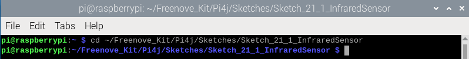
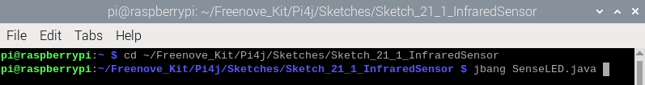
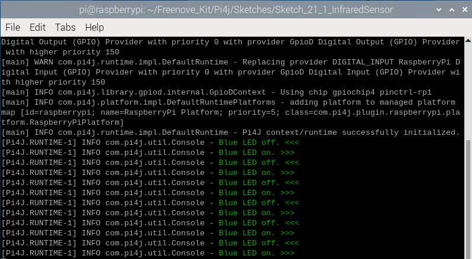
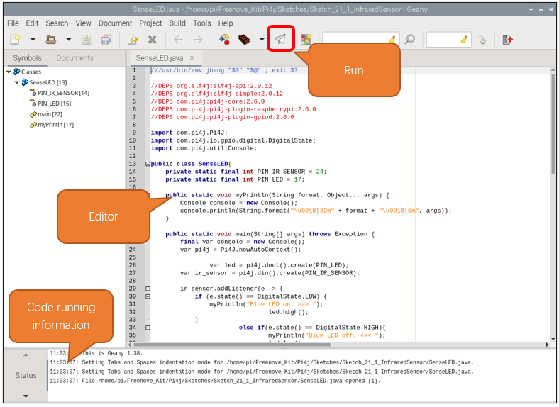

##############################################################################
Chapter Infrared Motion Sensor
##############################################################################

.. include:: ../common/com.Infrared Motion Sensor.rst

Sketch
================================================================

In this section, we will utilize an infrared motion sensor to control an LED, where the sensor will function as a motion-activated switch. The code is quite analogous to our previous project "Push Button Switch and LED." However, unlike the button which outputs a low signal when pressed, the infrared motion sensor outputs a high signal upon detecting motion. Consequently, when the sensor outputs a high level, the LED will illuminate or turn off.

Sketch_21_1_InfraredSensor
----------------------------------------------------------------

First, enter where the project is located:

.. code-block:: console

    $ cd ~/Freenove_Kit/Pi4j/Sketches/Sketch_21_1_InfraredSensor

Enter the command to run the code.

.. code-block:: console

    $ jbang SenseLED.java

Once the code is running, you can observe whether the LED turns on or off by moving away from or closer to the infrared motion sensor.

The terminal will continuously display the LED status, as shown below:

Press Ctrl+C to exit the program.

You can run the following command to open the code with Geany to view and edit it.

.. code-block:: console

    $ geany SenseLED.java

Click the icon to run the code.

If the code fails to run, please check :doc:`Geany Configuration`.

The following is program code:

.. literalinclude:: ../../../freenove_Kit/Pi4j/Sketches/Sketch_21_1_InfraredSensor/SenseLED.java
    :linenos: 
    :language: java
