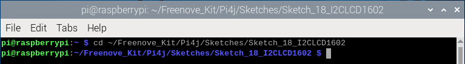
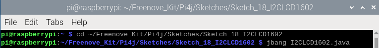
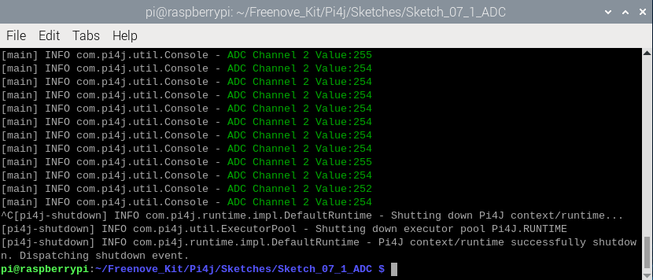
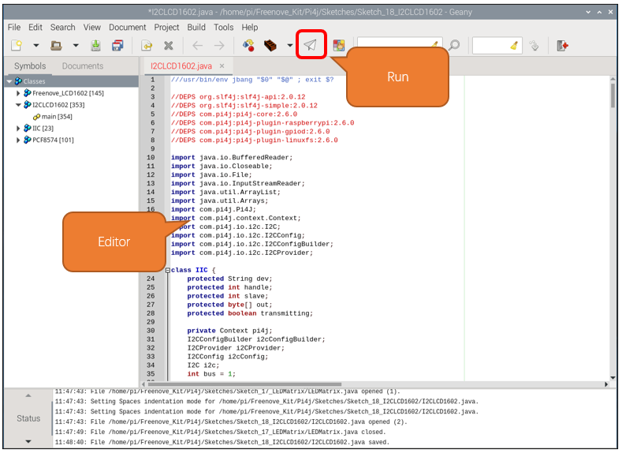

##############################################################################
Chapter LCD1602
##############################################################################

.. include:: ../common/com.LCD1602.rst

Sketch
================================================================

In this project, we will drive the LCD1602 display with I2C.

Sketch_18_I2CLCD1602
----------------------------------------------------------------

First, enter where the project is located:

.. code-block:: console

    $ cd ~/Freenove_Kit/Pi4j/Sketches/Sketch_18_I2CLCD1602
        

Enter the command to run the code.

.. code-block:: console

    $ jbang I2CLCD1602.java

When the code is running, you can see the first line of the display shows "Hello World", and the second line displays the running time in second.

Press Ctrl+C to exit the program.

You can run the following command to open the code with Geany to view and edit it.

.. code-block:: console

    $ geany I2CLCD1602.java

Click the icon to run the code.

If the code fails to run, please check :doc:`Geany Configuration`.

The following is program code:

.. literalinclude:: ../../../freenove_Kit/Pi4j/Sketches/Sketch_18_I2CLCD1602/I2CLCD1602.java
    :linenos: 
    :language: java

Constructor, assigns the I2C bus to bus, and calls the constructor function to initialize the I2C bus.

.. literalinclude:: ../../../freenove_Kit/Pi4j/Sketches/Sketch_18_I2CLCD1602/I2CLCD1602.java
    :linenos: 
    :language: java
    :lines: 40-53

I2C constructor, initialize the I2C bus.

.. literalinclude:: ../../../freenove_Kit/Pi4j/Sketches/Sketch_18_I2CLCD1602/I2CLCD1602.java
    :linenos: 
    :language: java
    :lines: 55-59

I2C bus acquisition function. Calling the list() function can obtain the names of all I2C buses currently existing on the Raspberry Pi.

.. literalinclude:: ../../../freenove_Kit/Pi4j/Sketches/Sketch_18_I2CLCD1602/I2CLCD1602.java
    :linenos: 
    :language: java
    :lines: 87-101
    
Use the pi4j library to repackage the I2C functions. These functions refer to the classic usage of Arduino. This is to be compatible with the subsequent PCF8574 class and Freenove_LCD1602 class, making it easier to drive LCD1602.

.. literalinclude:: ../../../freenove_Kit/Pi4j/Sketches/Sketch_18_I2CLCD1602/I2CLCD1602.java
    :linenos: 
    :language: java
    :lines: 61-85

The following are the two classes we wrote for LCD1602 in reference to Arduino. Here, we do not go into too much detail here. If you are interested in this code, you can use Geany to view the code.

.. code-block:: python

    class PCF8574 {
      ......
    }

    class Freenove_LCD1602 {
      ......
    }

Initialize PCF8574 and Freenove_LCD1602 classes, and assign the value to LCD.

.. literalinclude:: ../../../freenove_Kit/Pi4j/Sketches/Sketch_18_I2CLCD1602/I2CLCD1602.java
    :linenos: 
    :language: java
    :lines: 376-378

At the first lin of LCD1602, print the character “Hello World”.

.. literalinclude:: ../../../freenove_Kit/Pi4j/Sketches/Sketch_18_I2CLCD1602/I2CLCD1602.java
    :linenos: 
    :language: java
    :lines: 379-380

Print the character “Count” and the counts number at the second line every one second.

.. literalinclude:: ../../../freenove_Kit/Pi4j/Sketches/Sketch_18_I2CLCD1602/I2CLCD1602.java
    :linenos: 
    :language: java
    :lines: 382-389

In Java, an `InterruptedException` is thrown when a thread's waiting, sleeping (e.g., using 'Thread.sleep()'), or other blocking operations are interrupted. When a thread is interrupted, its interrupted status is set to true, and any of these blocking operations will result in an 'InterruptedException' being thrown.

When 'InterruptedException' is capured, 'Thread.currentThread().interrupt()' is called keep the interrupt status, so that the thread can respond to the interruption request appropriately.

.. literalinclude:: ../../../freenove_Kit/Pi4j/Sketches/Sketch_18_I2CLCD1602/I2CLCD1602.java
    :linenos: 
    :language: java
    :lines: 390-392
