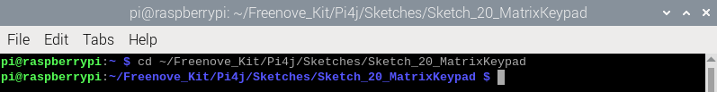
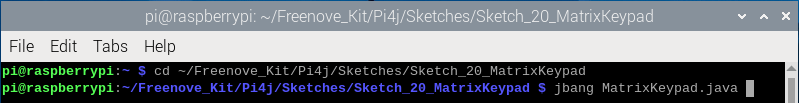
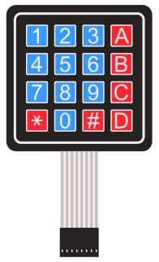
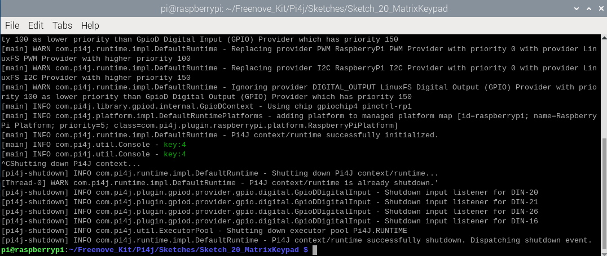
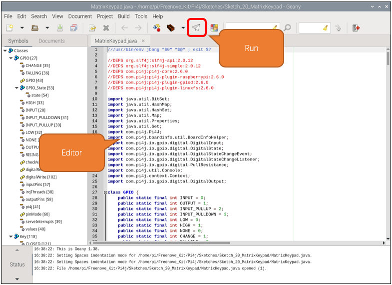

##############################################################################
Chapter Matrix Keypad
##############################################################################

.. include:: ../common/com.Matrix Keypad.rst

Sketch
================================================================

In this chapter, we will learn to use a martrix keypad.

Sketch_20_MatrixKeypad
----------------------------------------------------------------

First, enter where the project is located:

.. code-block:: console

    $ cd ~/Freenove_Kit/Pi4j/Sketches/Sketch_20_MatrixKeypad

Enter the command to run the code.

.. code-block:: console

    $ jbang MatrixKeypad.java

When the code is running, press any key on the keypad and the corresponding value will be printed on the terminal.

Press Ctrl+C to exit the program.

You can run the following command to open the code with Geany to view and edit it.

.. code-block:: console

    $ geany MatrixKeypad.java

Click the icon to run the code.

If the code fails to run, please check :doc:`Geany Configuration`.

The following is program code:

.. literalinclude:: ../../../freenove_Kit/Pi4j/Sketches/Sketch_20_MatrixKeypad/MatrixKeypad.java
    :linenos: 
    :language: java

Re-encapsulate the GPIO functions using the Pi4J library, with these functions referring to the classic usage of Arduino. This is done to ensure compatibility with the later Key class and Keypad class, making matrix buttons easier to use. If you are interested in this code, please review it, as we will include detailed comments within the code.

.. code-block:: c

    class GPIO {
      ... ...
    }

    //class Key:Define some of the properties of Key
    class Key {
      ... ...
    }

    class Keypad {
      ... ...
    }

Define the key values corresponding to the matrix keyboard.

.. literalinclude:: ../../../freenove_Kit/Pi4j/Sketches/Sketch_20_MatrixKeypad/MatrixKeypad.java
    :linenos: 
    :language: java
    :lines: 413-418

Define pin numbers for the row and column the matrix keyboard.

.. literalinclude:: ../../../freenove_Kit/Pi4j/Sketches/Sketch_20_MatrixKeypad/MatrixKeypad.java
    :linenos: 
    :language: 
    :lines: 420-423

The key value is read from the matrix keyboard every 10 milliseconds. If the key value is not detected as empty, it is printed on the terminal interface.

.. literalinclude:: ../../../freenove_Kit/Pi4j/Sketches/Sketch_20_MatrixKeypad/MatrixKeypad.java
    :linenos: 
    :language: 
    :lines: 448-457