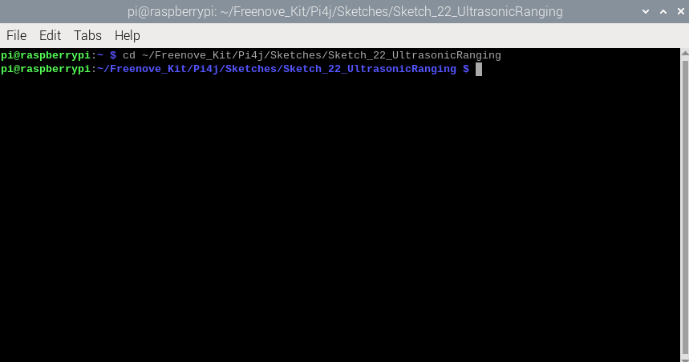
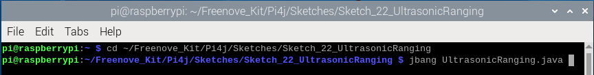
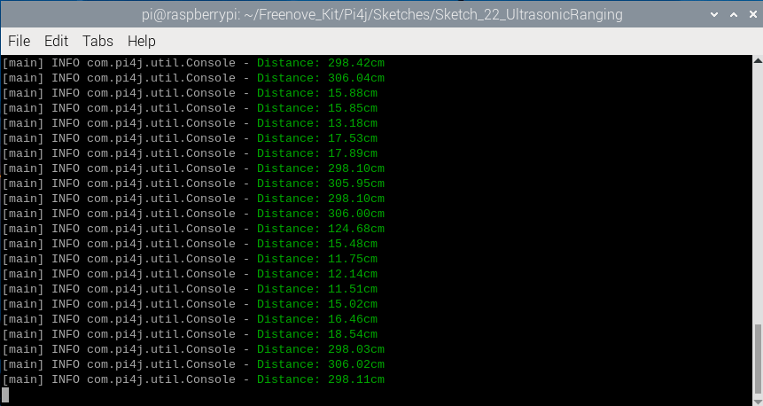
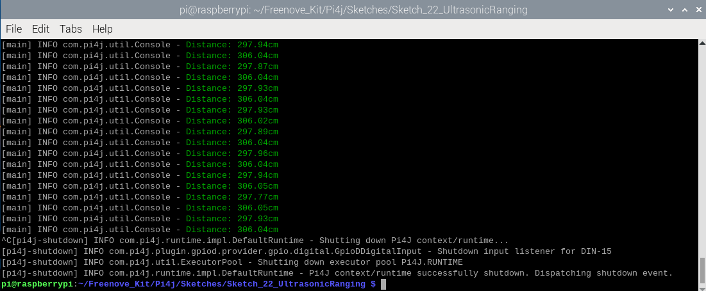
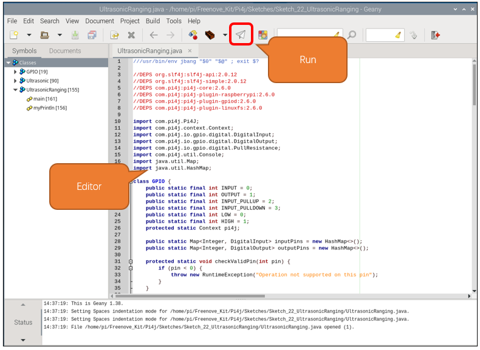

##############################################################################
Chapter Ultrasonic Ranging
##############################################################################

.. include:: ../common/com.Ultrasonic Ranging.rst

Sketch
================================================================

In this chapter, we will learn the usage of the ultrasonic sensor.

Sketch_22_UltrasonicRanging
----------------------------------------------------------------

First, enter where the project is located:

.. code-block:: console

    $ cd ~/Freenove_Kit/Pi4j/Sketches/Sketch_22_UltrasonicRanging

Enter the command to run the code.

.. code-block:: console

    $ jbang UltrasonicRanging.java

After running the code, the Raspberry Pi will continue to obtain the distance values of the ultrasonic module and print them on the terminal interface

Press Ctrl+C to exit the program.

You can run the following command to open the code with Geany to view and edit it.

.. code-block:: console

    $ geany UltrasonicRanging.java

Click the icon to run the code.

If the code fails to run, please check :doc:`Geany Configuration`.

The following is program code:

.. literalinclude:: ../../../freenove_Kit/Pi4j/Sketches/Sketch_22_UltrasonicRanging/UltrasonicRanging.java
    :linenos: 
    :language: java

Re-encapsulate the GPIO functions using the Pi4J library, with these functions emulating the classic usage patterns of Arduino. This is done to ensure compatibility with the upcoming Ultrasonic class, allowing the Raspberry Pi to easily obtain distance data from ultrasonic modules. If you are interested in this code, please review it, as we will include detailed comments within the code.

.. code-block:: c

    class GPIO {  
      ... ...
    }  
    
    class Ultrasonic {  
      ... ...
    } 

Initialize the Pi4J context and assign it to GPIO.pi4.

Initialize the Ultrasonic class and associate it with GPIO14 and GPIO15.

.. literalinclude:: ../../../freenove_Kit/Pi4j/Sketches/Sketch_22_UltrasonicRanging/UltrasonicRanging.java
    :linenos: 
    :language: java
    :lines: 178-181

Obtain the ultrasonic distance data every 100 milliseconds and display them on the terminal interface.

.. literalinclude:: ../../../freenove_Kit/Pi4j/Sketches/Sketch_22_UltrasonicRanging/UltrasonicRanging.java
    :linenos: 
    :language: java
    :lines: 183-191

At the end of the code, release the resources.

.. literalinclude:: ../../../freenove_Kit/Pi4j/Sketches/Sketch_22_UltrasonicRanging/UltrasonicRanging.java
    :linenos: 
    :language: java
    :lines: 194-199
