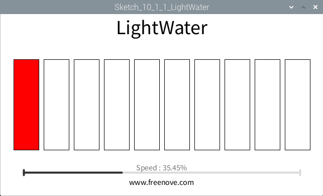
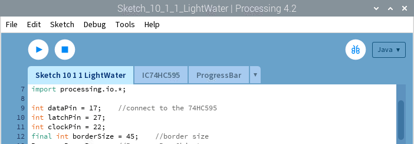

################################################################
Chapter 74HC595 & LED Bar Graph
################################################################

.. include:: ../common/com.74HC595 & Bar Graph LED.rst

Sketch
================================================================

Sketch 10.1.1 LightWater
----------------------------------------------------------------

First, observe the result after running the sketch, and then learn about the code in detail.
1.	Use Processing to open the file Sketch_10_1_1_LightWater.

.. code-block:: console    
    
    $ processing ~/Freenove_Kit/Processing/Sketches/Sketch_10_1_1_LightWater/Sketch_10_1_1_LightWater.pde

2.	Click on "RUN" to run the code.

After the program is executed, Display Window shows a virtual LED Bar Graph, which will bright at the same rate and in the same way as the LED Bar Graph in the circuit. Dragging the progress bar can adjust the flow rate of light water.

This project contains a lot of code files, and the core code is contained in the file Sketch_10_1_1_LightWater. The other files only contain some custom classes.

The following is program code:

.. literalinclude:: ../../../freenove_Kit/Code/Processing_Code/Sketches/Sketch_10_1_1_LightWater/Sketch_10_1_1_LightWater.pde
    :linenos: 
    :language: java

First define the GPIO pin connected to 74HC595, the ProgressBar class object, IC74HC595 class object, and some other variables.

.. literalinclude:: ../../../freenove_Kit/Code/Processing_Code/Sketches/Sketch_10_1_1_LightWater/Sketch_10_1_1_LightWater.pde
    :linenos: 
    :language: java
    :lines: 9-17

In the function setup(), instantiate ProgressBar class object and IC74HC595 class object.

.. literalinclude:: ../../../freenove_Kit/Code/Processing_Code/Sketches/Sketch_10_1_1_LightWater/Sketch_10_1_1_LightWater.pde
    :linenos: 
    :language: java
    :lines: 20-22

Then according to the speed of followlight, calculate the data “leds” for 74HC595, and write it to 74HC595, then LEDBar Graph is turned on.

.. literalinclude:: ../../../freenove_Kit/Code/Processing_Code/Sketches/Sketch_10_1_1_LightWater/Sketch_10_1_1_LightWater.pde
    :linenos: 
    :language: java
    :lines: 31-37

Finally, according to the variable leds, draw the virtual LEDBar Graph on Display Window.

.. literalinclude:: ../../../freenove_Kit/Code/Processing_Code/Sketches/Sketch_10_1_1_LightWater/Sketch_10_1_1_LightWater.pde
    :linenos: 
    :language: java
    :lines: 39-48

About class IC74HC595:

.. c:function:: class IC74HC595

    This is a custom class that is used to operate integrated circuit 74HC595.

    **public IC74HC595(int dPin, int lPin, int cPin)** 

    Constructor. The parameters are for the GPIO pins connected to 74HC595.
    
    **public void write(int order,int value)**

    Used to write data to 74HC595, and the 74HC595 output port will output these data immediately.
