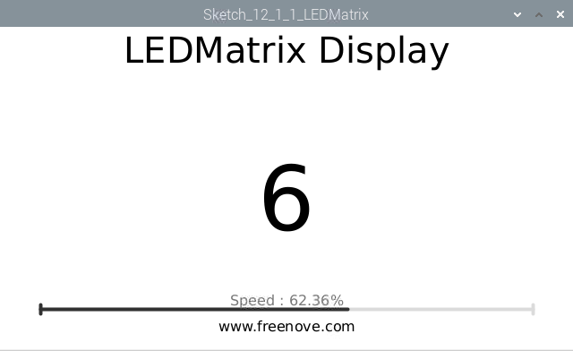
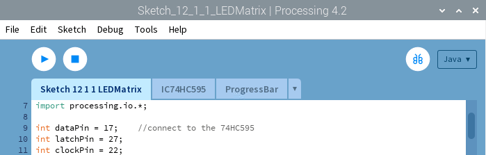

################################################################
Chapter 74HC595 & LED Matrix
################################################################

.. include:: ../common/com.74HC595 & LED Matrix.rst

Sketch
================================================================

Sketch 12.1.1 LEDMatrix
----------------------------------------------------------------

First observe the result after running the sketch, and then learn about the code in detail.
1.	Use Processing to open the file Sketch_12_1_1_LEDMatrix.

.. code-block:: console    
    
    $ processing ~/Freenove_Kit/Processing/Sketches/Sketch_12_1_1_LEDMatrix/Sketch_12_1_1_LEDMatrix.pde

2.	Click on "RUN" to run the code.

After the program is executed, LEDMatrix will show a pattern of a smiling face, then start scrolling display of character "0-F". Display Window will display the characters "0-F" synchronously. Dragging the progress bar can change the rolling speed of character on LEDMatrix. (The project code in the LEDMatrix is operated with scanning method in a separate thread. The uncertainty of the CPU time slice may cause LEDMatrix display flashing.)

This project contains a lot of code files, and the core code is contained in the file Sketch_12_1_1_LEDMatrix. The other files only contain some custom classes.

The following is program code:

.. literalinclude:: ../../../freenove_Kit/Code/Processing_Code/Sketches/Sketch_12_1_1_LEDMatrix/Sketch_12_1_1_LEDMatrix.pde
    :linenos: 
    :language: c

In the code, first define the data of the smiling face and characters "0-F".

.. literalinclude:: ../../../freenove_Kit/Code/Processing_Code/Sketches/Sketch_12_1_1_LEDMatrix/Sketch_12_1_1_LEDMatrix.pde
    :linenos: 
    :language: c
    :lines: 17-39

Then create a new thread t. LEDMatrix scan display code will be executed in run() of this thread.

.. literalinclude:: ../../../freenove_Kit/Code/Processing_Code/Sketches/Sketch_12_1_1_LEDMatrix/Sketch_12_1_1_LEDMatrix.pde
    :linenos: 
    :language: c
    :lines: 40-63

The function setup(), defines size of Display Window, ProgressBar class objects and IC75HC595 class object, and starts the thread t.

.. literalinclude:: ../../../freenove_Kit/Code/Processing_Code/Sketches/Sketch_12_1_1_LEDMatrix/Sketch_12_1_1_LEDMatrix.pde
    :linenos: 
    :language: c
    :lines: 41-47

In draw(), draw the relevant information and the current number to display.

.. literalinclude:: ../../../freenove_Kit/Code/Processing_Code/Sketches/Sketch_12_1_1_LEDMatrix/Sketch_12_1_1_LEDMatrix.pde
    :linenos: 
    :language: c
    :lines: 49-63

Subfunction showMatrix () makes LEDMatrix display a smiling face pattern, which lasts for a period of time.

.. literalinclude:: ../../../freenove_Kit/Code/Processing_Code/Sketches/Sketch_12_1_1_LEDMatrix/Sketch_12_1_1_LEDMatrix.pde
    :linenos: 
    :language: c
    :lines: 64-75

Subfunction showNum() makes LEDMatrix scroll displaying character "0-F", in which the variable k is used to adjust the scrolling speed.

.. literalinclude:: ../../../freenove_Kit/Code/Processing_Code/Sketches/Sketch_12_1_1_LEDMatrix/Sketch_12_1_1_LEDMatrix.pde
    :linenos: 
    :language: c
    :lines: 76-90

If you have more interests in LED matrix, you can download an interesting app to explore.

https://play.google.com/store/apps/details?id=com.vitogusmano.arduinoledmatrixanimator

If you have any concerns about the app, please contact with Vito Gusmano (vigus9000@gmail.com).
