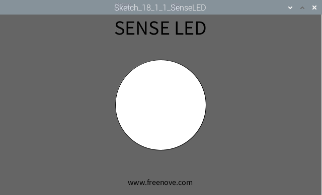

################################################################
Chapter Infrared Motion Sensor
################################################################

.. include:: ../common/com.Infrared Motion Sensor.rst

Sketch
================================================================

Sketch 18.1.1 SenseLED
----------------------------------------------------------------

First, observe the result after running the sketch, and then learn about the code in detail.

1.	Use Processing to open the file Sketch_18_1_1_SenseLED.

.. code-block:: console    
    
    $ processing ~/Freenove_Kit/Processing/Sketches/Sketch_18_1_1_SenseLED/Sketch_18_1_1_SenseLED.pde

2.	Click on "RUN" to run the code.

After the program is executed, Display Window shows the following interface, where the middle circle indicates the LED. Color of the circle is white when LED is off, green when LED is on.

The following is program code:

.. literalinclude:: ../../../freenove_Kit/Code/Processing_Code/Sketches/Sketch_18_1_1_SenseLED/Sketch_18_1_1_SenseLED.pde
    :linenos: 
    :language: c

In this project, the code is relatively simple. In the function draw(), read level of sensor pin. When it is a high level, LED is turned on. At the same time the filled color will be changed to green. When the level is low, LED turns off and the filled color turns white. Finally, it draws a circle.

.. literalinclude:: ../../../freenove_Kit/Code/Processing_Code/Sketches/Sketch_18_1_1_SenseLED/Sketch_18_1_1_SenseLED.pde
    :linenos: 
    :language: c
    :lines: 17-29