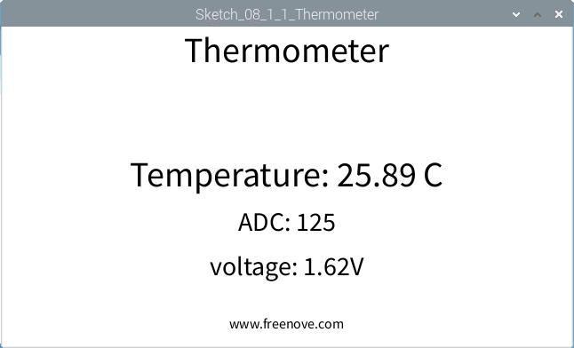

################################################################
Chapter Thermistor
################################################################

.. include:: ../common/com.Thermistor.rst

Sketch
================================================================

Sketch 8.1.1 Thermometer
----------------------------------------------------------------

First, observe the result after running the sketch, and then learn about the code in detail.
1.	Use Processing to open the file Sketch_08_1_1_Thermometer.

.. code-block:: console

    $ processing ~/Freenove_Kit/Processing/Sketches/Sketch_08_1_1_Thermometer/Sketch_08_1_1_Thermometer.pde

2.	Click on "RUN" to run the code.

After the program is executed, the Display Window will show the current temperature, the ADC value and the voltage value.

This project contains a lot of code files, and the core code is contained in the file Sketch_08_1_1_Thermometer. The other files only contain some custom classes.

.. image:: ../_static/imgs/pr_Thermistor_code.rst.png
    :align: center

The following is program code:

.. literalinclude:: ../../../freenove_Kit/Code/Processing_Code/Sketches/Sketch_08_1_1_Thermometer/Sketch_08_1_1_Thermometer.pde
    :linenos: 
    :language: java