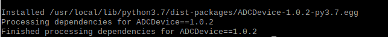

.. _ADC:

################################################################
Chapter ADC
################################################################

.. include:: ../common/com.ADC.rst

Install Smbus Module
----------------------------------------------------------------

.. code-block:: console

    $ sudo apt-get install python-smbus

.. code-block:: console

    $ sudo apt-get install python3-smbus

Code
================================================================

Python Code 7.1.1 ADC
----------------------------------------------------------------

For Python code, ADCDevice requires a custom module which needs to be installed.

1.	Use cd command to enter folder of ADCDevice.

.. code-block:: console

    $ cd ~/Freenove_Kit/Libs/Python-Libs/

2.	Unzip the file.

.. code-block:: console

    $ tar zxvf ADCDevice-1.0.3.tar.gz

3.	Open the unzipped folder.

.. code-block:: console

    $ cd ADCDevice-1.0.3

4.	Install library for python3 and python2.
.. code-block:: console

    $ sudo python3 setup.py install 
    $ sudo python2 setup.py install

A successful installation, without error prompts, is shown below:

Execute the following command. Observe the project result and then learn about the code in detail.

.. hint:: 
    :red:`If you have any concerns, please contact us via:`  support@freenove.com

1. Use ``cd`` command to enter 07.1.1_ADC directory of Python code.

.. code-block:: console

    $ cd ~/Freenove_Kit/Code/Python_GPIOZero_Code/07.1.1_ADC

2. Use the Python command to execute the Python code ``ADC.py``.

.. code-block:: console

    $ python ADC.py

After the program is executed, adjusting the potentiometer will produce a readout display of the potentiometer voltage values in the Terminal and the converted digital content. 

The following is the code:

.. literalinclude:: ../../../freenove_Kit/Code/Python_GPIOZero_Code/07.1.1_ADC/ADC.py
    :linenos: 
    :language: python

In this code, a custom Python module "ADCDevice" is used. It contains the method of utilizing the ADC Module in this project, through which the ADC Module can easily and quickly be used. In the code, you need to first create an ADCDevice object adc.

.. code-block:: python

    adc = ADCDevice() # Define an ADCDevice class object

Then in setup(), use detecticIC(addr), the member function of ADCDevice, to detect the I2C module in the circuit. Different modules have different I2C addresses. Therefore, according to the address, we can determine which ADC Module is in the circuit. When the correct module is detected, a device specific class object is created and assigned to adc. The default address of PCF8591 is 0x48, and that of ADS7830 is 0x4b.

.. literalinclude:: ../../../freenove_Kit/Code/Python_GPIOZero_Code/07.1.1_ADC/ADC.py
    :linenos: 
    :language: python
    :lines: 13-23

When you have a class object of a specific device, you can get the ADC value of the specified channel by calling the member function of this class, analogRead(chn). In loop(), get the ADC value of potentiometer.

.. code-block:: python

    value = adc.analogRead(0)   # read the ADC value of channel 0
    
Then according to the formula, the voltage value is calculated and displayed on the terminal monitor.

.. code-block:: python

    voltage = value / 255.0 * 3.3  # calculate the voltage value
    print ('ADC Value : %d, Voltage : %.2f'%(value,voltage))
    time.sleep(0.1)

Reference
----------------------------------------------------------------

About smbus Module:

.. c:function:: smbus Module

    The System Management Bus Module defines an object type that allows SMBus transactions on hosts running the Linux kernel. The host kernel must support I2C, I2C device interface support, and a bus adapter driver. All of these can be either built-in to the kernel, or loaded from modules.
    In Python, you can use help(smbus) to view the relevant functions and their descriptions.
    **bus=smbus.SMBus(1)**:Create an SMBus class object.
    **bus.read_byte_data(address,cmd+chn)**: Read a byte of data from an address and return it.
    **bus.write_byte_data(address,cmd,value)**: Write a byte of data to an address.

.. c:function:: class ADCDevice(object)

    This is a base class. 

    int detectI2C(int addr);

    This is a member function, which is used to detect whether the device with the given I2C address exists. If it exists, it returns true. Otherwise, it returns false.

.. c:function:: class PCF8591(ADCDevice) & class ADS7830(ADCDevice)

    These two classes are derived from the ADCDevice and the main function is analogRead(chn).

    int analogRead(int chn);

    This returns the value read on the supplied analog input pin.

    Parameter chn: For PCF8591, the range of chn is 0, 1, 2, 3. For ADS7830, the range is 0, 1, 2, 3, 4, 5, 6, 7.

You can find the source file of this library in the folder below: 

.. code-block:: console

    ~/Freenove_Kit/Libs/Python-Libs/ADCDevice-1.0.3/src/ADCDevice/ADCdevice.py