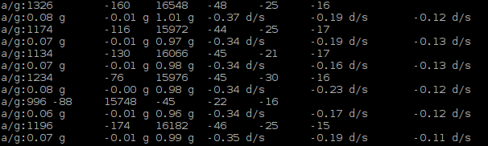

################################################################
Chapter Attitude Sensor MPU6050
################################################################

.. include:: ../common/com.Attitude Sensor MPU6050.rst

Code
================================================================

In this project, we will read the acceleration data and gyroscope data of MPU6050, and print them out.

Python Code 25.1.1 MPU6050RAW
----------------------------------------------------------------

First, observe the project result, and then learn about the code in detail.

.. hint:: 
    :red:`If you have any concerns, please contact us via:`  support@freenove.com

1.	Use ``cd`` command to enter 25.1.1_MPU6050RAW directory of Python code.

.. code-block:: console

    $ cd ~/Freenove_Kit/Code/Python_GPIOZero_Code/25.1.1_MPU6050

2.	Use Python command to execute code ``MPU6050RAW.py``.

.. code-block:: console

    $ python MPU6050RAW.py

After the program is executed, the Terminal will display active accelerometer and gyroscope data of the MPU6050, as well as the conversion to gravity acceleration and angular velocity as units of data. As shown in the following figure:

The following is the program code:

.. literalinclude:: ../../../freenove_Kit/Code/Python_GPIOZero_Code/25.1.1_MPU6050/MPU6050RAW.py
    :linenos: 
    :language: python

A module "MPU6050.py" is used in the code. The module includes a class used to operate MPU6050. When used, first initiate an object.

.. code-block:: python

    mpu = MPU6050.MPU6050()

In the setup function, the MPU6050 is initialized.

.. code-block:: python

    def setup():
        mpu.dmp_initialize()

In the loop function, read the original data of MPU6050, display them and then convert the original data into the corresponding acceleration and angular velocity values, then display the converted data out.

.. literalinclude:: ../../../freenove_Kit/Code/Python_GPIOZero_Code/25.1.1_MPU6050/MPU6050RAW.py
    :linenos: 
    :language: python
    :lines: 17-24

About class MPU6050:

.. c:function:: Class MPU6050

    This is a class library used to operate MPU6050, which can directly read and set MPU6050. Here are some member functions:
    
    **def __init__** (self, a_bus=1, a_address=C.MPU6050_DEFAULT_ADDRESS,

                    a_xAOff=None, a_yAOff=None, a_zAOff=None, a_xGOff=None,

                    a_yGOff=None, a_zGOff=None, a_debug=False):
    
    Constructor

    **def dmp_initialize** (self):

    Initialization function, used to wake up MPU6050. Range of accelerometer is ±2g and range of gyroscope is ±250 degrees/sec.

    **def get_acceleration** (self):   &   **def get_rotation** (self):

    Get the original data of accelerometer and gyroscope.

For details of more relevant member functions, please refer to MPU6050.py in the code folder.