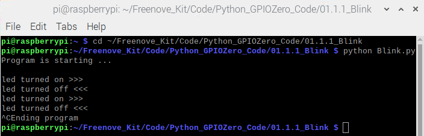
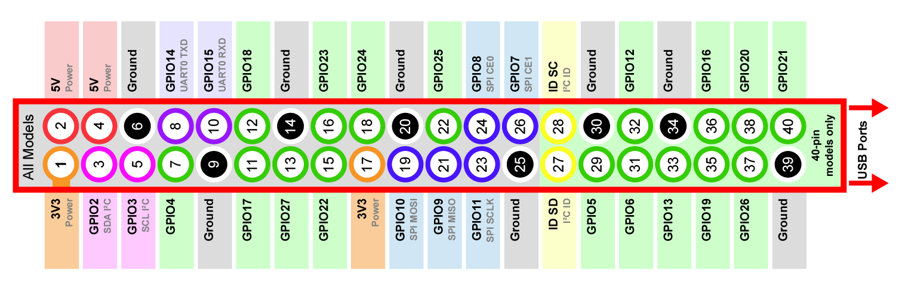

################################################################
Chapter LED
################################################################
.. include:: ../common/com.blink.rst
    
Code
================================================================
According to the circuit, when the GPIO17 of RPi output level is high, the LED turns ON. Conversely, when the GPIO17 RPi output level is low, the LED turns OFF. Therefore, we can let GPIO17 cycle output high and output low level to make the LED blink. We will use Python code to achieve the target.

Python Code 1.1.1 Blink
----------------------------------------------------------------
Now, we will use Python language to make a LED blink.

First, observe the project result, and then learn about the code in detail. 

.. hint:: 
    :red:`If you have any concerns, please contact us via:`  support@freenove.com
    
1.	Use cd command to enter 01.1.1_Blink directory of Python code.

.. code-block:: console

    $ cd ~/Freenove_Kit/Code/Python_GPIOZero_Code/01.1.1_Blink

2.	Use python command to execute python code blink.py.

.. code-block:: console

    $ python Blink.py

The LED starts blinking.

You can press “Ctrl+C” to end the program. The following is the program code:

.. literalinclude:: ../../../freenove_Kit/Code/Python_GPIOZero_Code/01.1.1_Blink/Blink.py
    :linenos: 
    :language: python

Import the LED class from the gpiozero library.

.. code-block:: python

    from gpiozero import LED

Create an LED assembly for controlling the LED.

.. code-block:: python

    led = LED(17)           # define LED pin according to BCM Numbering

Turn on LED device.

.. code-block:: python
    
    led.on()    # turn on LED

Turn off LED devices.
.. code-block:: python
    
    led.off()   # turn off LED

The main function turns on the LED for one second and then turns it off for one second, which repeats endless.

.. literalinclude:: ../../../freenove_Kit/Code/Python_GPIOZero_Code/01.1.1_Blink/Blink.py
    :linenos: 
    :language: python
    :lines: 22-29

Reference
----------------------------------------------------------------

About GPIO Zero:

.. c:function:: GPIO Zero;

    A simple interface to GPIO devices with Raspberry Pi, Using the GPIO Zero library makes it easy to get started with controlling GPIO devices with Python. The library is comprehensively documented at 
    
    https://gpiozero.readthedocs.io/en/stable/

    https://github.com/gpiozero/gpiozero

For more information about the methods used by the LED class in the GPIO Zero library,please refer to: https://gpiozero.readthedocs.io/en/stable/api_output.html#led

For more information about the methods used by the DigitalOutputDevice class in the GPIO Zero library,please refer to: https://gpiozero.readthedocs.io/en/stable/api_output.html#digitaloutputdevice 

“import time” time is a module of python. https://docs.python.org/2/library/time.html?highlight=time%20time#module-time

In Python, libraries and functions used in a script must be imported by name at the top of the file, with the exception of the functions built into Python by default.

For example, to use the LED interface from GPIO Zero, it should be explicitly imported:

.. code-block:: python

    from gpiozero import LED

.. code-block:: python

    led = LED(17)           # define LED pin according to BCM Numbering
    #led = LED("J8:11")     # BOARD Numbering

Alternatively, the whole GPIO Zero library can be imported:

.. code-block:: python

    import gpiozero

In this case, all references to items within GPIO Zero must be prefixed: 

.. code-block:: python

    led = gpiozero.LED(17)           # define LED pin according to BCM Numbering
    #led = gpiozero.LED("J8:11")     # BOARD Numbering

**Pin Numbering**

This library uses Broadcom (BCM) pin numbering for the GPIO pins, as opposed to physical (BOARD)
numbering. Unlike in the RPi.GPIO library, this is not configurable. However, translation from other
schemes can be used by providing prefixes to pin numbers (see below).

Any pin marked “GPIO” in the diagram below can be used as a pin number. For example, if an LED
was attached to “GPIO17” you would specify the pin number as 17 rather than 11:

If you wish to use physical (BOARD) numbering you can specify the pin number as “BOARD11”. If you
are familiar with the wiringPi pin numbers (another physical layout) you could use “WPI0” instead.

Finally, you can specify pins as “header:number”, e.g. “J8:11” meaning physical pin 11 on header J8
(the GPIO header on modern Pis). Hence, the following lines are all equivalent:

.. code-block:: python

    led = LED(17)
    led = LED("GPIO17")
    led = LED("BCM17")
    led = LED("BOARD11")
    led = LED("WPI0")
    led = LED("J8:11")

.. note::

    Note that these alternate schemes are merely translations. If you request the state of a device on thecommand line, the associated pin number will always be reported in the Broadcom (BCM) scheme:

.. code-block:: python

        led = LED("BOARD11")
        led
    <gpiozero.LED object on pin GPIO17, active_high=True, is_active=False>

:red:`In this tutorial, we will use the default integer pin number in the Broadcom (BCM) layout.`

**GPIO Numbering Relationship**

.. list-table::
   :align: center
   :header-rows: 1
   :class: product-table

   * - WingOi
     - BCM(Extension)
     - Physical
     - Physical
     - BCM(Extension)
     - WingPi

   * - 3.3V
     - 3.3V
     - 1
     - 2
     - 5V
     - 5V

   * - 8
     - GPIO2/SDA1
     - 3
     - 4
     - 5V
     - 5V
    
   * - 9
     - GPIO3/SCL1
     - 5
     - 6
     - GND
     - GND
     
   * - 7
     - GPIO4
     - 7
     - 8
     - GPIO14/TXD0
     - 15

   * - GND
     - GND
     - 9
     - 10
     - GPIO15/RXD0
     - 16

   * - 0
     - GPIO17
     - 11
     - 12
     - GPIO18
     - 1

   * - 2
     - GPIO27
     - 13
     - 14
     - GND
     - GND   

   * - 3
     - GPIO22
     - 15
     - 16
     - GPIO23
     - 4

   * - 3.3V
     - 3.3V
     - 17
     - 18
     - GPIO24
     - 5

   * - 12
     - GPIO10/MOSI
     - 19
     - 20
     - GND
     - GND
    
   * - 13
     - GPIO9/MOIS
     - 21
     - 22
     - GPIO25
     - 6
     
   * - 14
     - GPIO11/SCLK
     - 23
     - 24
     - GPIO8/CE0
     - 10

   * - GND
     - GND
     - 25
     - 26
     - GPIO7/CE1
     - 11  

   * - 30
     - GPIO0/SDA0
     - 27
     - 28
     - BGPIO1/SCL0
     - 31

   * - 21
     - GPIO5
     - 29
     - 30
     - GND
     - GND  

   * - 22
     - GPIO6
     - 31
     - 32
     - GPIO12
     - 26

   * - 23
     - GPIO13
     - 33
     - 34
     - GND
     - GND  

   * - 24
     - GPIO19
     - 35
     - 36
     - GPIO16
     - 27

   * - 25
     - GPIO26
     - 37
     - 38
     - GPIO20
     - 28    
    
   * - GND
     - GND
     - 39
     - 40
     - GPIO21
     - 29   

In loop(), there is a while loop, which is an endless loop (a while loop). That is, the program will always be executed in this loop, unless it is ended because of external factors. In this loop, set LED output high level, then the LED turns ON. After a period of time delay, set LED output low level, then the LED turns OFF, which is followed by a delay. Repeat the loop, then LED will start blinking. 

.. literalinclude:: ../../../freenove_Kit/Code/Python_GPIOZero_Code/01.1.1_Blink/Blink.py
    :linenos: 
    :language: python
    :lines: 22-29

In gpiozero, at the end of your script, cleanup is run automatically, restoring your GPIO pins to the state they were found.To explicitly close a connection to a pin, you can manually call the close() method on a device object:

.. code-block:: python

        led = LED(17)
        led.on()
        led
    <gpiozero.LED object on pin GPIO17, active_high=True, is_active=True>
        led.close()
        led
    <gpiozero.LED object closed>

This means that you can reuse the pin for another device, and that despite turning the LED on (and hence, the pin high), after calling close() it is restored to its previous state (LED off, pin low).
In this tutorial, most projects have added an active run cleanup program to restore the GPIO pin to the found default state.

.. include:: ../common/com.freenove_car.rst