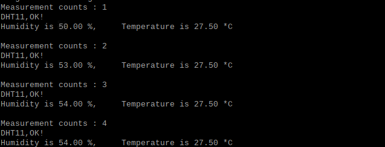

################################################################
Chapter 74HC595 & LED Matrix
################################################################

.. include:: ../common/com.Hygrothermograph DHT11.rst

Code
================================================================

The code is used to read the temperature and humidity data of DHT11, and display them.

Python Code 21.1.1 DHT11
----------------------------------------------------------------

First, observe the project result, and then learn about the code in detail.

.. hint:: 
    :red:`If you have any concerns, please contact us via:`  support@freenove.com

1.	Use ``cd`` command to enter folder of the ADC Device library.

.. code-block:: console

    $ cd ~/Freenove_Kit/Libs/Python-Libs/Freenove_DHT11

2.	Execute command below to install the library.

.. code-block:: console

    $ sudo python setup.py

A successful installation, without error prompts, is shown below:

.. image:: ../_static/imgs/DHT11_code.png
    :align: center

Next, we will execute the code for this project. 

1.	Use ``cd`` command to enter 21.1.1_DHT11 directory of Python code.

.. code-block:: console

    $ cd ~/Freenove_Kit/Code/Python_GPIOZero_Code/21.1.1_DHT11

2.	Use Python command to execute code ``DHT11.py``.

.. code-block:: console

    $ python DHT11.py

After the program is executed, the Terminal window will display the current total number of read times, the read state, as well as temperature and humidity values as is shown below:

Since gpiozero does not support DHT11 sensors, RPi.GPIO is used here for control.

The following is the program code:

.. literalinclude:: ../../../freenove_Kit/Code/Python_GPIOZero_Code/21.1.1_DHT11/DHT11.py
    :linenos: 
    :language: python

In this project code, we use a module "Freenove_DHT.py", which provides the method of reading the DHT Sensor. It is located in the same directory with program files "DHT11.py". By using this library, we can easily read the DHT Sensor. First, we create a DHT class object in the code.

.. code-block:: python

    dht = DHT.DHT(DHTPin)   #create a DHT class object

Then in the "while" loop, use chk = dht.readDHT11() to read the DHT11, and determine whether the data read is normal according to the return value "chk". Then use variable sumCnt to record the number of times read.

.. literalinclude:: ../../../freenove_Kit/Code/Python_GPIOZero_Code/21.1.1_DHT11/DHT11.py
    :linenos: 
    :language: python
    :lines: 17-28

Finally display the results:

.. code-block:: python

    print("Humidity : %.2f, \t Temperature : %.2f \n"%( dht.getHumidity(), dht.getTemperature()))

Module "Freenove_DHT.py" contains a DHT class. The class function of the def readDHT11 (pin) is used to read the DHT11 Sensor and store the temperature and humidity data read to member variables humidity and temperature. 

.. c:function:: Freenove_DHT Module

    This is a Python module for reading the temperature and humidity data of the DHT Sensor. Partial functions and variables are described as follows:
    
    getHumidity(): store humidity data read from sensor
    
    getTemperature(): store temperature data read from sensor
    
    readDHT11(): read the temperature and humidity of sensor DHT11, and return values used to determine whether the data is normal.
