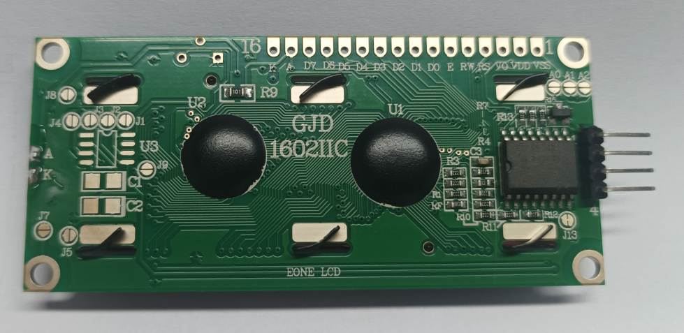

################################################################
Chapter LCD1602
################################################################

.. include:: ../common/com.LCD1602.rst

Code
================================================================

This code will have your RPi's CPU temperature and System Time Displayed on the LCD1602.

Python Code 20.1.1 I2CLCD1602
----------------------------------------------------------------

If you did not configure I2C and install Smbus, please refer to :doc:`Chapter 7 ADC <ADC>`. If you did, continue.

First, observe the project result, and then learn about the code in detail.

.. hint:: 
    :red:`If you have any concerns, please contact us via:`  support@freenove.com

1.	Use ``cd`` command to enter 20.1.1_ I2CLCD1602 directory of Python code.

.. code-block:: console

    $ cd ~/Freenove_Kit/Code/Python_GPIOZero_Code/20.1.1_I2CLCD1602

2.	Use Python command to execute Python code ``I2CLCD1602.py``.

.. code-block:: console

    $ python I2CLCD1602.py

After the program is executed, the LCD1602 Screen will display your RPi's CPU Temperature and System Time. 
So far, at this writing, we have two types of LCD1602 on sale. One needs to adjust the backlight, and the other does not.

The LCD1602 that does not need to adjust the backlight is shown in the figure below.

If the LCD1602 you received is the following one, and you cannot see anything on the display or the display is not clear, try rotating the white knob on back of LCD1602 slowly, which adjusts the contrast, until the screen can display clearly.

.. image:: ../_static/imgs/LCD1602_clear.png
    :align: center

The following is the program code:

.. literalinclude:: ../../../freenove_Kit/Code/Python_GPIOZero_Code/20.1.1_I2CLCD1602/I2CLCD1602.py
    :linenos: 
    :language: python

In a while loop, set the cursor position, and display the CPU temperature and time.

.. literalinclude:: ../../../freenove_Kit/Code/Python_GPIOZero_Code/20.1.1_I2CLCD1602/I2CLCD1602.py
    :linenos: 
    :language: python
    :lines: 26-30

CPU temperature is stored in file “/sys/class/thermal/thermal_zone0/temp”. Open the file and read content of the file, and then convert it to Celsius degrees and return. Subfunction used to get CPU temperature is shown below:

.. literalinclude:: ../../../freenove_Kit/Code/Python_GPIOZero_Code/20.1.1_I2CLCD1602/I2CLCD1602.py
    :linenos: 
    :language: python
    :lines: 14-18

Subfunction used to get time:

.. code-block:: python

    def get_time_now():     # get the time
        return datetime.now().strftime('    %H:%M:%S')

**Details about LCD1602.py:**

.. c:function:: Module LCD1602

    This module provides the basic operation method of LCD1602, including class CharLCD1602. 
    
    Some member functions are described as follows:
    
    def init_lcd(self,addr=None, bl=1) : LDC1602 initializes the setting.  When the addr is None, the I2C address of the device will be automatically scanned.  You can also specify the I2C address, bl=1 to enable the backlight setting.
    
    def clear(self): clear the screen
    
    def send_command(self,comm): set the cursor position
    
    def i2c_scan(self): scan the device I2C address
    
    def write(self,x, y, str): display contents

.. note::

    More information can be viewed through opening LCD1602.py.
