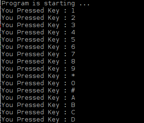

################################################################
Chapter Matrix Keypad
################################################################

.. include:: ../common/com.Matrix Keypad.rst

Code
================================================================

This code is used to obtain all key codes of the 4x4 Matrix Keypad, when one of the keys is pressed, the key code will be displayed in the terminal window.

Python Code 22.1.1 MatrixKeypad
----------------------------------------------------------------

First, observe the project result, and then learn about the code in detail.

.. hint:: 
    :red:`If you have any concerns, please contact us via:`  support@freenove.com

1.	Use cd command to enter 22.1.1_MatrixKeypad directory of Python code.

.. code-block:: console

    $ cd ~/Freenove_Kit/Code/Python_GPIOZero_Code/22.1.1_MatrixKeypad

2.	Use Python command to execute code "MatrixKeypad.py".

.. code-block:: console

    $ python MatrixKeypad.py

After the program is executed, pressing any key on the MatrixKeypad, will display the corresponding key code on the Terminal. As is shown below:

The following is the program code:

.. literalinclude:: ../../../freenove_Kit/Code/Python_GPIOZero_Code/22.1.1_MatrixKeypad/MatrixKeypad.py
    :linenos: 
    :language: python

In this project code, we use a custom module "**Keypad.py**", which is located in the same directory with program file "**MatrixKeypad.py**". And this library file, which is transplanted from Arduino function library Keypad, provides a method to read the keyboard. By using this library, we can easily read the matrix keyboard.
First, import module Keypad. Then define the information of the matrix keyboard used in this project: the number of rows and columns, code of each key and GPIO pin connected to each column and each row.

.. literalinclude:: ../../../freenove_Kit/Code/Python_GPIOZero_Code/22.1.1_MatrixKeypad/MatrixKeypad.py
    :linenos: 
    :language: python
    :lines: 8-16

Then, based on the above information, initiates a Keypad class object to operate the Matrix Keyboard.

.. code-block:: python

    keypad = Keypad.Keypad(keys,rowsPins,colsPins,ROWS,COLS)

Set the debounce time to 50ms, and this value can be set based on the actual characteristics of the keyboard's flexibly, with a default time of 10ms.

.. code-block:: python

    keypad.setDebounceTime(50)

In the "while" loop, use the function key= keypad.getKey () to read the keyboard constantly. If there is a key pressed, its key code will be stored in the variable "key", and then be displayed.

.. literalinclude:: ../../../freenove_Kit/Code/Python_GPIOZero_Code/22.1.1_MatrixKeypad/MatrixKeypad.py
    :linenos: 
    :language: python
    :lines: 20-23

The Keypad Library used for the RPi is “transplanted” from the Arduino Keypad Library. The source files is written by language C++ and translated into Python can be obtained by visiting http://playground.arduino.cc/Code/Keypad. As for the “transplanted” function library, the function and method of all classes, functions, variables, etc. are the same as the original library. Partial contents of the Keypad Library are described below:

.. c:function:: class Keypad

    **def __init__** (self,usrKeyMap,row_Pins,col_Pins,num_Rows,num_Cols):

    Constructed function, the parameters are: key code of keyboard, row pin, column pin, the number of rows, the number of columns.
    
    **def getKey** (self):
    
    Get a pressed key. If no key is pressed, the return value is keypad NULL.
    
    **def setDebounceTime** (self,ms):
    
    Set the debounce time. And the default time is 10ms.
    
    **def setHoldTime** (self,ms):
    
    Set the time when the key holds stable state after pressed.
    
    **def isPressed** (keyChar):
    
    Judge whether the key with code "keyChar" is pressed.
    
    **def waitForKey** ():
    
    Wait for a key to be pressed, and return key code of the pressed key.
    
    **def getState** ():
    
    Get state of the keys.
    
    **def keyStateChanged** ():
    
    Judge whether there is a change of key state, then return True or False.

For More information about Keypad, please visit: http://playground.arduino.cc/Code/Keypad or through the opening file "Keypad.py".

For more information about the methods used by the InputDevice class in the GPIO Zero library,please refer to: https://gpiozero.readthedocs.io/en/stable/api_input.html#inputdevice

For more information about the methods used by the OutputDevice class in the GPIO Zero library,please refer to: https://gpiozero.readthedocs.io/en/stable/api_output.html#outputdevice

