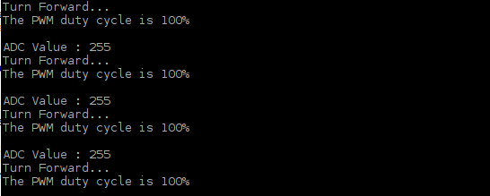

################################################################
Chapter Motor & Driver
################################################################

.. include:: ../common/com.Motor & Driver.rst

Code
================================================================

In code for this project, first read the ADC value and then control the rotation direction and speed of the DC Motor according to the value of the ADC.

Python Code 13.1.1 Motor
----------------------------------------------------------------

If you did not configure I2C and install Smbus, please refer to :doc:`Chapter 7 ADC <ADC>`. If you did, please Continue.

First, observe the project result, and then learn about the code in detail.

.. hint:: 
    :red:`If you have any concerns, please contact us via:`  support@freenove.com

1.	Use cd command to enter 13.1.1_Motor directory of Python code.

.. code-block:: console

    $ cd ~/Freenove_Kit/Code/Python_GPIOZero_Code/13.1.1_Motor

2.	Use python command to execute the Python code “Motor.py”. 

.. code-block:: console

    $ python Motor.py

After the program is executed, you can use the Potentiometer to control the DC Motor. When the Potentiometer is at the midpoint position, the DC Motor will STOP, and when the Potentiometer is turned in either direction of this midpoint, the DC Motor speed increases until it reaches the endpoint where the DC Motor achieves its maximum speed. When the Potentiometer is turned “Left” of the midpoint the DC Motor will ROTATE in one direction and when turned “Right” the DC Motor will ROTATE in the opposite direction. You will also see the ADC value of the potentiometer displayed in the Terminal with the motor direction and the PWM duty cycle used to control the DC Motor's speed.

The following is the code:

.. literalinclude:: ../../../freenove_Kit/Code/Python_GPIOZero_Code/13.1.1_Motor/Motor.py
    :linenos: 
    :language: python

Now that we have familiarity with reading ADC values, let's learn the subfunction void motor (int ADC): first, compare the ADC value with 128 (value corresponding to midpoint). When the current ADC value is higher, motoRPin1 outputs high level and motoRPin2 outputs low level to control the DC Motor to run in the “Forward” Rotational Direction. When the current ADC value is lower, motoRPin1 outputs low level and motoRPin2 outputs high level to control the DC Motor to run in the “Reverse” Rotational Direction. When the ADC value is equal to 128, motoRPin1 and motoRPin2 output low level, the motor STOPS. Then determine the PWM duty cycle according to the difference (delta) between ADC value and 128. Because the absolute delta value stays within 0-128. We need to use the map() subfunction mapping the delta value to a range of 0-255.

Finally, we see a display of the duty cycle in Terminal.

.. literalinclude:: ../../../freenove_Kit/Code/Python_GPIOZero_Code/13.1.1_Motor/Motor.py
    :linenos: 
    :language: python
    :lines: 34-50
