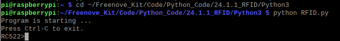
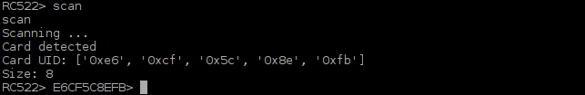
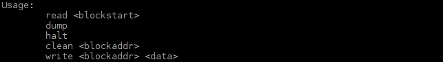
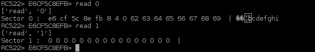
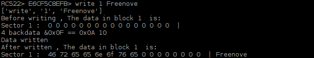
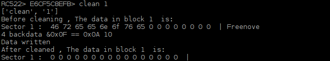
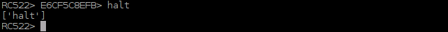

################################################################
Chapter RFID
################################################################

.. include:: ../common/com.RFID.rst

Code
================================================================

The project code uses human-computer interaction command line mode to read and write the M1-S50 card.

Python Code 34.1.1 RFID
----------------------------------------------------------------

There are two code files for this project. They are respectively under Python2 folder and Python3 folder. :red:`Their functions are the same, but they are not compatible.` Code under Python2 folder can only run on Python2. And code under Python3 folder can only run on Python3.

First observe the project result, and then learn about the code in detail.

.. hint:: 
    :red:`If you have any concerns, please contact us via:`  support@freenove.com

1.	Use cd command to enter RFID directory of Python code.

.. code-block:: console

    $ cd ~/Freenove_Kit/Code/Python_GPIOZero_Code/34.1.1_RFID

2.	Use python command to execute code "RFID.py".

.. code-block:: console

    $ python RFID.py

After the program is executed, the following contents will be displayed in the terminal:

Here, type the command “quit” to exit the program.

Type command "scan", then the program begins to detect whether there is a card close to the sensing area of MFRC522 reader. Place a M1-S50 card in the sensing area. The following results indicate that the M1-S50 card has been detected, the UID of which is E6CF5C8EFB (HEX).

When the Card is placed in the sensing area, you can read and write the card with the following command.

In the command read<blockstart>, the parameter blockstart is the address of the data block, and the range is 0-63. As is shown below:   

In the command read<blockstart>, the parameter blockstart is the address of the data block, and the range is 0-63. This command is used to read the data of data block with address “blockstart”. For example, using command “read 0” can display the content of data block 0. Using the command “read 1” can display the content of data block 1. As is shown below:   

Command “dump” is used to display the content of all data blocks in all sectors.

Command <address> <data> is used to write “data" to data block with address “address”, where the address range is 0-63 and the data length is 0-16. In the process of writing data to the data block, both the contents of data block before written and after written will be displayed. For example, if you want to write the string "Freenove" to the data block with address “1”, you can type the following command.

.. code-block:: console

    $ write 1 Freenove

Command “clean <address>” is used remove the contents of the data block with address "address". For example, if you want to clear the contents of the data block 1 that has just been written, you can type the following command.

.. code-block:: console

    $ clean 1

Command “halt” is used to quit the selection state of the card.

The following is the program code :

.. literalinclude:: ../../../freenove_Kit/Code/Python_GPIOZero_Code/34.1.1_RFID/RFID.py
    :linenos: 
    :language: python

In the code, first create an MFRC522 class object.

.. code-block:: python

    mfrc = MFRC522.MFRC522()

In the function loop, wait for the command input. If command "scan" is received, the function will begin to detect whether there is a card close to the sensing area. If a card is detected, the card will be selected and card UID will be acquired. Then enter the function scan_loop (). If command "quit" or "exit" is received, the program will exit.

.. literalinclude:: ../../../freenove_Kit/Code/Python_GPIOZero_Code/34.1.1_RFID/RFID.py
    :linenos: 
    :language: python
    :lines: 32-57

The function cmdloop() will detect command read, write, clean, halt, dump and do the corresponding processing to each command. The functions of each command and the method have been introduced before.

.. literalinclude:: ../../../freenove_Kit/Code/Python_GPIOZero_Code/34.1.1_RFID/RFID.py
    :linenos: 
    :language: python
    :lines: 59-138

The file "MFRC522.py" contains the associated operation method for the MFRC522. You can open the file to view all the definitions and functions.

