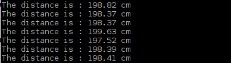
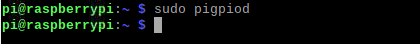

################################################################
Chapter Ultrasonic Ranging
################################################################

.. include:: ../common/com.Ultrasonic Ranging.rst

Code
================================================================

Python Code 24.1.1 UltrasonicRanging
----------------------------------------------------------------

First, observe the project result, and then learn about the code in detail.

.. hint:: 
    :red:`If you have any concerns, please contact us via:`  support@freenove.com

1.	Use cd command to enter 24.1.1_UltrasonicRanging directory of Python code.

.. code-block:: console

    $ cd ~/Freenove_Kit/Code/Python_GPIOZero_Code/24.1.1_UltrasonicRanging

2.	Use Python command to execute code "UltrasonicRanging.py".

.. code-block:: console

    $ python UltrasonicRanging.py

After the program is executed, aim the Ultrasonic Ranging Module's detectors (“eyes”) perpendicular to the surface of an object (try using your hand). The distance between the ultrasonic module and the object will be displayed in the terminal. As is shown below:

The following is the program code:

.. literalinclude:: ../../../freenove_Kit/Code/Python_GPIOZero_Code/24.1.1_UltrasonicRanging/UltrasonicRanging.py
    :linenos: 
    :language: python

First, define the pins and the maximum measurement distance.

.. literalinclude:: ../../../freenove_Kit/Code/Python_GPIOZero_Code/24.1.1_UltrasonicRanging/UltrasonicRanging.py
    :linenos: 
    :language: python
    :lines: 11-13

Finally, in the while loop of main function, get the measurement distance and display it continually. 

.. literalinclude:: ../../../freenove_Kit/Code/Python_GPIOZero_Code/24.1.1_UltrasonicRanging/UltrasonicRanging.py
    :linenos: 
    :language: python
    :lines: 15-18

For more information about the methods used by the DistanceSensor class in the GPIO Zero library,please refer to: https://gpiozero.readthedocs.io/en/stable/api_input.html#distancesensor-hc-sr04

In the above experiments, you can see that the measurement data is unstable.

.. note::

    For improved accuracy, use the pigpio pin driver rather than the default RPi.GPIO driver (pigpio uses DMA sampling for much more precise edge timing). This is particularly relevant if you’re using Pi 1 or Pi Zero. 

You can refer to UltrasonicRanging2.py for detailed code. 

1.  Use cd command to enter 15.1.1_Sweep directory of Python code.
.. code-block:: console

    $ cd ~/Freenove_Kit/Code/Python_GPIOZero_Code/24.1.1_UltrasonicRanging

2.  Use python command to execute code "Sweep.py".

.. code-block:: console

    $ python UltrasonicRanging2.py

After the program is executed, the distance between the ultrasonic module and the measured object will be displayed on the terminal. At this point, the data is more accurate and stable.

This code is based on pigpio libarary. In the latest Raspberry Pi OS, “pigpio” library has been installed. You only need to run the command to enable it.

.. code-block:: console

    $ sudo pigpiod

If the “pigpio” library has not yet been installed, please follow the steps to install it.

Run the command to install “pigpio” library.

.. code-block:: console

    $ sudo apt-get update
    $ sudo apt-get install pigpio python-pigpio python3-pigpio

The following is the program code:

.. literalinclude:: ../../../freenove_Kit/Code/Python_GPIOZero_Code/24.1.1_UltrasonicRanging/UltrasonicRanging2.py
    :linenos: 
    :language: python

.. seealso::

    See Changing the pin factory for further information:
    https://gpiozero.readthedocs.io/en/stable/api_pins.html#changing-pin-factory
