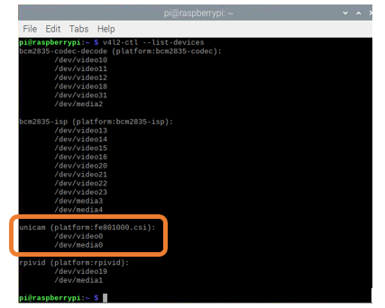
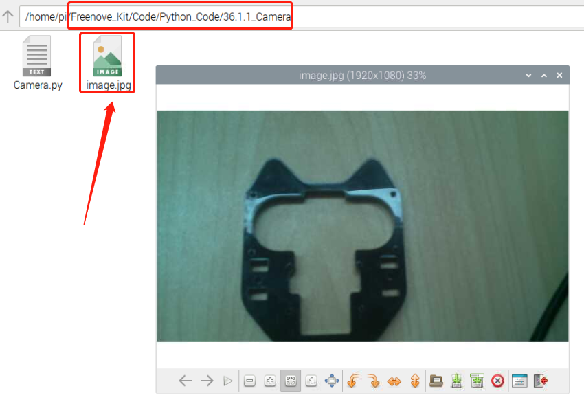

################################################################
Chapter camera
################################################################

.. include:: ../common/com.camera_1.rst

Code
================================================================

Detect camera:

.. code-block:: console

    $ v4l2-ctl --list-devices

If you do not get the result above, please check whether the camera wire is connected correctly.

.. note::

    :red:`When plugging in or pulling out camera wire, please make sure Raspberry Pi is turned OFF. Otherwise, it may burn out the camera.`

Python Code 36.1.1 Camera
----------------------------------------------------------------

First observe the project result, and then learn about the code in detail.

.. hint:: 
    :red:`If you have any concerns, please contact us via:`  support@freenove.com

1.  Use ``cd`` command to enter 36.1.1_Camera directory of Python code.

.. code-block:: console

    $ cd ~/Freenove_Kit/Code/Python_GPIOZero_Code/36.1.1_Camera

2.  Use python command to execute code ``Camera.py``

.. code-block:: console

    $ python Camera.py

After the program is executed, you can take a photo by pressing the button. When the button is pressed, you will see image.jpg in the corresponding directory. As shown below:

.. literalinclude:: ../../../freenove_Kit/Code/Python_GPIOZero_Code/36.1.1_Camera/Camera.py
    :linenos: 
    :language: python

Read the signal pin of the button, and determine whether the button is pressed, if the button is pressed, take a photo and save it in the corresponding directory.

.. literalinclude:: ../../../freenove_Kit/Code/Python_GPIOZero_Code/36.1.1_Camera/Camera.py
    :linenos: 
    :language: python
    :lines: 17-27

.. include:: ../common/com.camera_2.rst

Code
================================================================

Detect camera:

.. code-block:: console

    $ v4l2-ctl --list-devices

If you do not get the result above, please check whether the camera wire is connected correctly.

.. note::

    :red:`When plugging in or pulling out camera wire, please make sure Raspberry Pi is turned OFF. Otherwise, it may burn out the camera.`

Python Code 36.2.1 Video
----------------------------------------------------------------

First observe the project result, and then learn about the code in detail.

.. hint:: 
    :red:`If you have any concerns, please contact us via:`  support@freenove.com

1.  Use cd command to enter 36.2.1_Camera directory of Python code.

.. code-block:: console

    $ cd ~/Freenove_Kit/Code/Python_GPIOZero_Code/36.2.1_Video
    
2.  Use python command to execute code "Video.py"

.. code-block:: console

    $ python Video.py

After the program is executed, you can shoot a video by pressing the button. When the shooting button is pressed, you will see Video.h264 in the corresponding directory. When the play button is pressed, the corresponding captured video will be played, as shown in the image below. You can repeat the above operation to capture other videos, but it will overwrited the previous video.

.. image:: ../_static/imgs/py_camera_1.png
    :align: center

The following is the program code:

.. literalinclude:: ../../../freenove_Kit/Code/Python_GPIOZero_Code/36.2.1_Video/Video.py
    :linenos: 
    :language: python

Read the signal pin of the shooting button, and determine whether the button is pressed, if the button is pressed, shoot a video and save it in the corresponding directory.

.. literalinclude:: ../../../freenove_Kit/Code/Python_GPIOZero_Code/36.2.1_Video/Video.py
    :linenos: 
    :language: python
    :lines: 21-31

Read the signal pin of the play button, and determine whether the button is pressed. If the button is pressed, use the ffplay tool to play the corresponding video. When the video finishes playing, the playback interface will be closed automatically.

.. literalinclude:: ../../../freenove_Kit/Code/Python_GPIOZero_Code/36.2.1_Video/Video.py
    :linenos: 
    :language: python
    :lines: 33-36

